# BTLO: Enter The Dragon 1

<!-- Original publication date: 2023-12-31 -->

## Intoduction

In this write-up I am going to do the “Enter The Dragon 1” investigation from BTLO

Difficulty: Easy

Scenario: A customer has activated their incident response retainer following the discovery of a suspected malicious executable on one of their hosts. The executable was detected during routine Security Operation Centre (SOC) threat hunt activities. SOC analysts have performed basic static analysis of the executable but were unable to identify any Indicators of Compromise (IOCs). You have been tasked with performing static disassembly of the executable. Due to time constraints the only tool available is Ghidra.

Requirements: BTLO VM

Tools: Ghidra

**Disclaimer: As this investigation was previously completed, I can no longer view past answers, as such, I cannot guarantee that the answers are correct.**

## Question 1: What is the MD5 of the executable?

Let’s open a PowerShell command and run the following command:

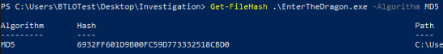

> As such, the answer to Question 1 is:

> 6932FF601D9B00FC59D773332518CBD0

## Question 2: What is the image base?

What is image base? According to ChatGPT: “The image base in the context of executable files, such as those in the Windows PE (Portable Executable) format, refers to the preferred memory address at which a binary (executable or DLL) is loaded into memory.”

Basically, let’s go to the beginning of the PE and see its VA (Virtual Address).

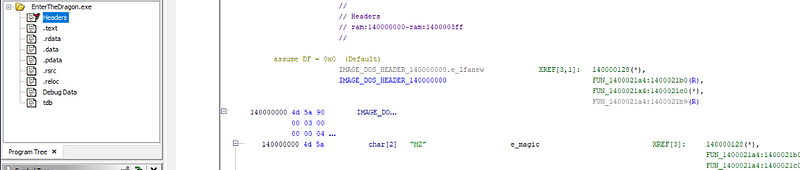

As we can see here, the first address is 140000000.

> As such, the answer to Question 2 is:

> 0x140000000

## Question 3: What is the RVA offset of the Entry Point?

First, let’s find the VA address of the entry point.

If we look at the “Symbol Tree” window we can search for “entry”. We will get a few options, but let’s select the “entry” under “Functions”.

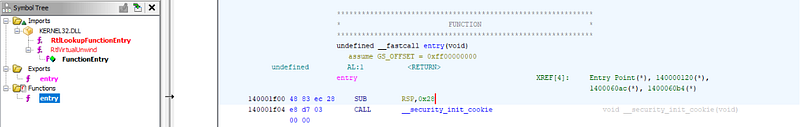

As we can see, the entry point is located at 140001f00.

Now that we know the VA of the Entry Point and the Image Base, we can find the RVA Offset of the Entry Point by:

- RVA Offset = Entry Point — Image Base
- RVA Offset = 0x140001f00 — 0x140000000

And we get 0x1f00.

> As such, the answer to Question 3 is:

> 0x1f00

## Question 4: What is the first function called from the entry point?

If we look here:

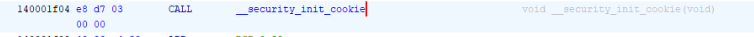

And also at the “Decompile” tab:

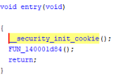

> As such, the answer to Question 4 is:

> \_\_security_init_cookie

## Question 5: At what Virtual Address (VA) offset is IsDebuggerPresent() called?

After searching for it in the “Symbol Tree” tab, we get:

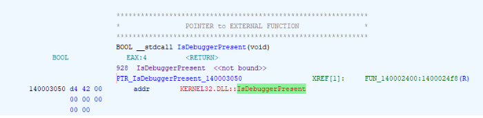

And if we hover over IsDebuggerPresent we get:

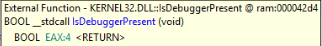

If we follow the cross-reference (XREF\[1\]) we get the Assembly and Decompiled version:

*Note: What is* [*XREF\[1\]*](https://reverseengineering.stackexchange.com/questions/18074/what-does-xref-mean)<em>?</em>

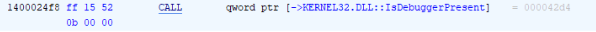

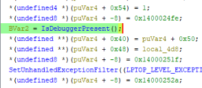

Now, there appeared a lot of addresses, so let’s talk about each one:

- FUN_140002400: This is the method in which IsDebuggerPresent() is called
- 0x1400024f8: This is where the method is called
- 0x140003050: This is where the call is pointed after it is previously called (I don’t exactly know that it does)
- ram:000042d4: Honestly, I don’t know :)

> As such, the answer to Question 5 is:

> 0x1400024f8

## Question 6: How many functions are imported from WININET.DLL?

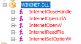

> As we can see, the answer to Question 6 is:

> 5

## Question 7: What security attribute (LPSECURITY_ATTRIBUTES) is used when the mutex object is created?

First of all, what is mutex? Accordint to [Microsoft](https://learn.microsoft.com/en-us/windows/win32/sync/mutex-objects): “Only one thread at a time can own a mutex object”. Self-explanatory right?

After searching for mutex in the “Symbol Tree”:

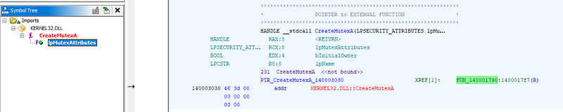

We’ll look at the cross-reference and see that it was called from the function FUN_140001790 and if we look at the decompiler we can find where it was called and with what parameters:

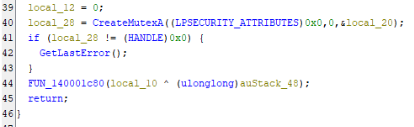

*Note: What are the* [*CreateMutexA*](https://learn.microsoft.com/en-us/windows/win32/api/synchapi/nf-synchapi-createmutexa) *function parameters?*

> As such, the answer to Question 7 is:

> 0x0

## Question 8: What is the name of the mutex object?

According to the Microsoft documentation:

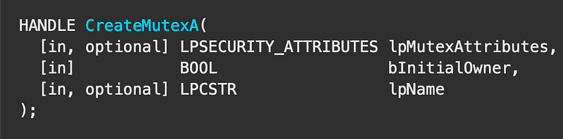

The name of the mutex object is given by the last parameter and has the data type LPCSTR.

*Note: What is* [*LPCSTR data type*](https://learn.microsoft.com/en-us/openspecs/windows_protocols/ms-dtyp/f8d4fe46-6be8-44c9-8823-615a21d17a61)<em>?</em>

From our previous question, we can see that we passed a pointer to “local_20” (\$local_20). For now I’ll rename him “mutex_name”. Let’s look what value “mutex_name” has:

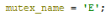

It looks like it holds the char ‘E’. If we try to answer the question with ‘E’ it will appear wrong. Now why is that? Let’s dig a little deeper in the LPCSTR datatype.

According to ChatGPT, for some more clarity (it took me a while to get to the bottom of it): \<In Windows programming, LPCSTR stands for "Long Pointer to a Constant STRing." It is a data type used to represent a pointer to a null-terminated string of 8-bit characters, which is typically used for ASCII strings.\>

What does this mean? Well, it won’t stop getting char characters from memory, consecutively, until it sees a NULL. We know that mutex_name = ‘E’. Does this end in a NULL? No.

Now let’s search for the NULL or ‘&#92;0’. After some digging and using Ghidra’s “Set Equate” function we get:

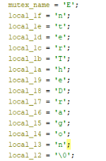

Now if we put it all together we get: EnterTheDragon.

> As such, the answer to Question 8 is:

> EnterTheDragon

## Question 9: Where does the sample copy itself to?

It appears that this malware is able to copy itself/replicate to other locations.

We get the following important hint: API-MS-WIN-CRT-STDIO-L 1–1–0.DLL

What we are interested in is the “fwrite” function:

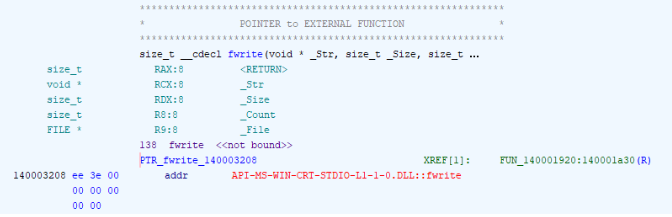

We once again go to the cross-reference and get this longer function:

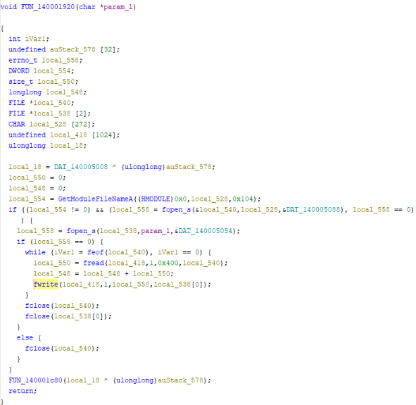

After reading the documentation for “fwrite” on [Microsoft](https://learn.microsoft.com/en-us/cpp/c-runtime-library/reference/fwrite?view=msvc-170), we look at the “local_538\[0\]” parameter. For now, I’ll rename it “file_location”.

!!Temp answer!! C:&#92;PerfLogs&#92;lee.exe (simply searched for strings in program and found it)

Q10: 1024 (fread(local_418,1,0x400,local_540);)

Q11: base64

Q12: <https://pastebin.com/AsasW19v>

[**Base64 Decode and Encode - Online** *Decode from Base64 format or encode into it with various advanced options. Our site has an easy to use online tool to…*www.base64decode.org](https://www.base64decode.org/ "https://www.base64decode.org/")

aHR0cHM6Ly9wYXN0ZWJpbi5jb20vQXNhc1cxOXY=

Q13: BoardsDontHitBack

Q14: SOFTWARE&#92;&#92;Microsoft&#92;&#92;Windows&#92;&#92;CurrentVersion&#92;&#92;Run

Q15: Bruce
