# BTLO Basilisk 1

<!-- Original publication date: 2024-03-17 -->

## Introduction

Difficulty: Easy

Scenario: \*too long\* Basically, you dream about a Basilisk and then you are tasked with analyzing a malware named Basilisk.

Tools: BinTexT, CFFExplorer, PEiD, ExeInfo, PEView

**Disclaimer: BTLO doesn’t allow you to view your past answers and I have previously completed this investigation, as such I cannot guarantee 100% that the answers are correct.**

## Question 1: Using the BinTexT tool, Is there a string that is related to a malicious executable?

On the Desktop we have a folder named “BTLO_LabFiles”, where all of our needed tools are.

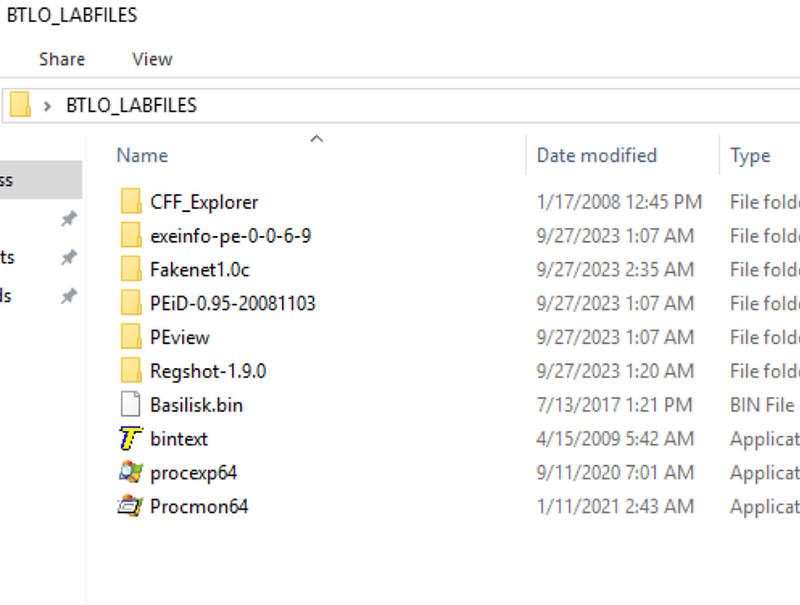

After running BinTexT, selecting the “Basilisk.bin” file and pressing “Go”, we get the following:

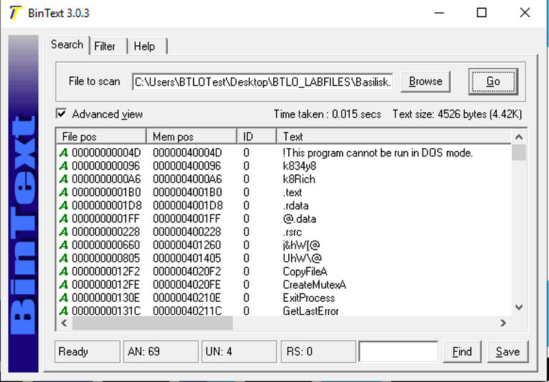

If we look through all the values, we get the following possible executables:

- kernel32.dll: “Provide access to the basic resources available to a Windows system”
- advapi32.dll: “Provides access to functions beyond the kernel. Included are things like the Windows registry, shutdown/restart the system (or abort) etc.”
- shell32.dll: “Component of the Windows API allows applications to access functions provided by the operating system shell”
- 39upd.dll: ??Unknown??

According to [Wikipedia](https://en.wikipedia.org/wiki/Windows_API), the only .dll which doesn’t appear is “39upd.dll”

> *As such, the answer to Question 1 is:*

> *39upd.dll*

## Question 2: Using the ExeInfo tool, what Windows version does Basilisk used to target? Give the complete machine version.

After opening ExeInfo, selecting “Basilisk.bin” and running it, we get:

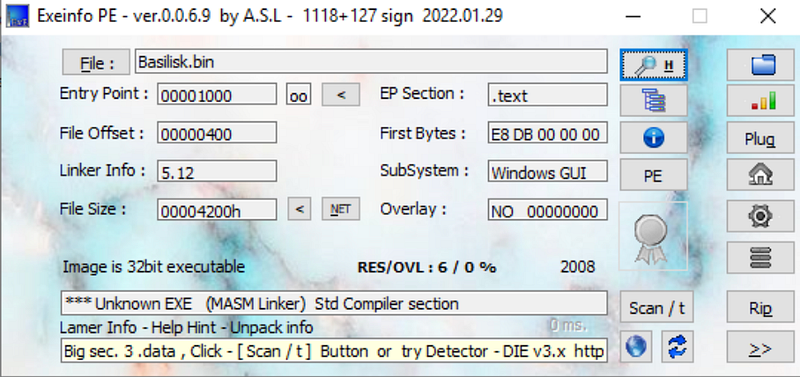

To the right of “SubSystem: Windows GUI” there is a “PE” button. After we press it we get:

*Note: PE means Portable Executable*

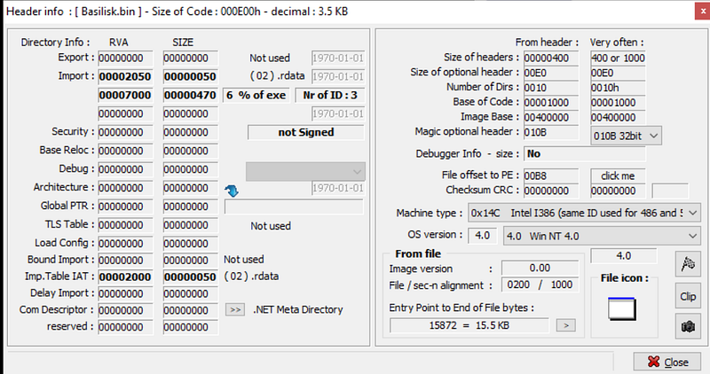

Here we get a new window with the following info:

- OS version: 4.0 ; 4.0 Win NT 4.0

> *As such, the answer to Question 2 is:*

> *Win NT 4.0*

## Question 3: Using the PEiD, what is the Entry Point? What is the EP section?

After opening PEiD and selecting “Basilisk.bin” we get:

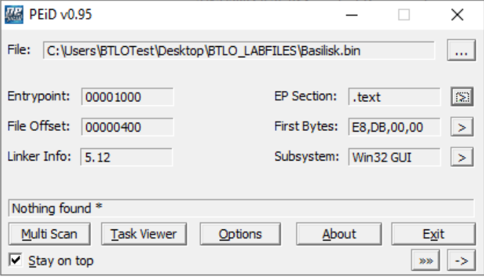

Now first what is EP/Entry Point? According to [Wikipedia](https://en.wikipedia.org/wiki/Entry_point), “In computer programming, an **entry point** is the place in a program where the execution of a program begins, and where the program has access to command line arguments.”

As we can see, the entry point is 00001000. This is an address in memory, it can also be written as 0x00001000.

Now what is an EP Section? Well, going by logic, assembly code is divided into sections i.e. .text, .data etc. Each section has a different purpose. For example, going by [Source 1](https://softwareengineering.stackexchange.com/questions/171565/why-is-the-code-section-called-a-text-section) and [Source 2](https://stackoverflow.com/questions/7254176/why-do-we-need-to-define-data-and-text-section-in-assembly) and [Source 3](https://mirzafahad.github.io/2021-05-08-text-data-bss/):

- .text: here goes your code, along with constants; Read-Only
- .data: global & static variables initialized after .text; Read-Write

> *As such the answer, to Question 3 is:*

> *00001000, .text*

## Question 4: Using the CFFExplorer tool, what is the Import Directory RVA Offset of Basilisk? What is the section?

After opening CFFExplorer and “Basilisk.bin” we get:

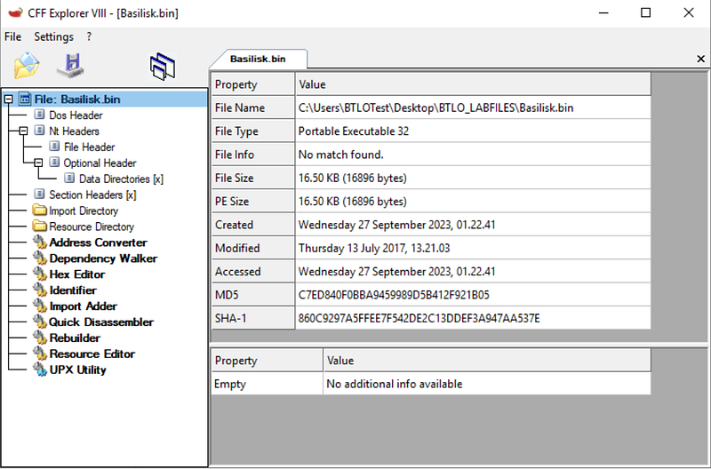

First of all, what is Import Directory? It basically contains the addresses of the libraries (.dll) that our program needs. For more info check [Microsoft](https://learn.microsoft.com/en-us/windows/win32/debug/pe-format#import-directory-table).

Now, what is RVA Offset? First of all, we need to find out what Physical Memory Address, VA (virtual address), RVA (relative VA) and Offset are. I recommend reading this [Stack Overflow post](https://stackoverflow.com/questions/2170843/va-virtual-address-rva-relative-virtual-address).

After navigating to the Data Directories we get:

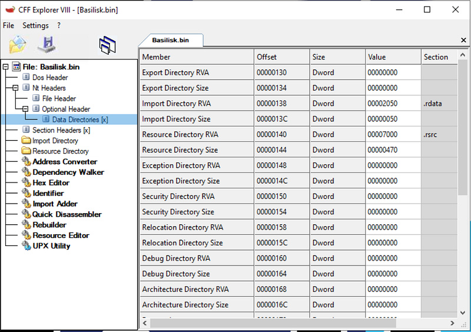

As we can see, our Import Directory RVA Offset is 00000138 and the Section is .rdata

*Note: .rdata =\> “*[*This is where the import information or read-only initialized data is located.*](https://library.mosse-institute.com/articles/2022/05/reverse-engineering-portable-executables-pe-part-2/reverse-engineering-portable-executables-pe-part-2.html)*”*

> *As such, the answer to Question 4 is:*

> *00000138, .rdata*

## Question 5: Using the CFFExplorer tool, What DLL is responsible for executing “ShellExecuteA” API?

Within CFFExplorer let’s navigate to the Import Directory:

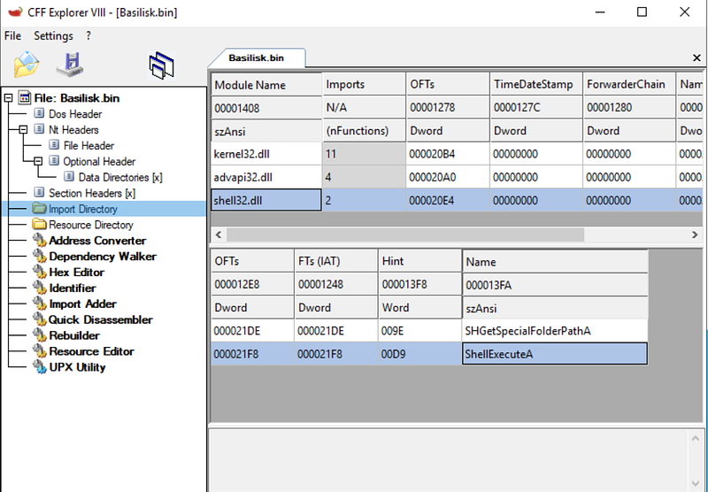

If we navigate some more we can see that the “ShellExecuteA” API is executed in the “shell32.dll”.

*Note: According to* [*Microsoft*](https://learn.microsoft.com/en-us/windows/win32/api/shellapi/nf-shellapi-shellexecutea)*, ShellExecuteA, in this case, is probably used to execute another program.*

> *As such, the answer to Question 5 is:*

> *shell32.dll*

## Question 6: Using the CFFExplorer tool, What DLL is responsible for executing registry related functions? What are these APIs?

Let’s change our view to the “advapi32.dll” file:

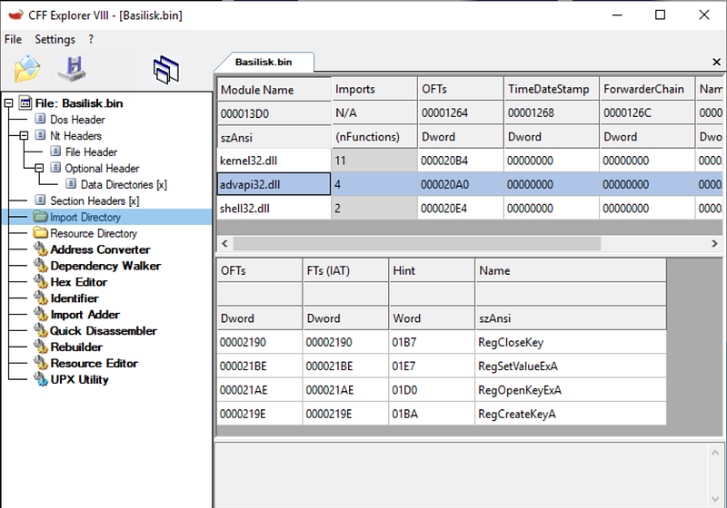

Here we can see the 4 registry functions: RegCloseKey, RegSetValueExA, RegOpenKeyExA, RegCreateKeyA.

*Note: All the registry functions:* [*https://learn.microsoft.com/en-us/windows/win32/api/winreg/*](https://learn.microsoft.com/en-us/windows/win32/api/winreg/)

> *As such, the answer to Question 6 is:*

> *RegCloseKey, RegSetValueExA, RegOpenKeyExA, RegCreateKeyA*

## Question 7: Using the CFFExplorer tool, What are all the modules imported by Basilisk?

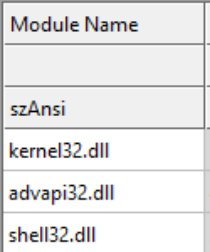

As we can see, the modules are: kernel32.dll, advapi32.dll, shell32.dll.

> *As such, the answer to Question 7 is:*

> *kernel32.dll, advapi32.dll, shell32.dll*

## Question 8: Using the PEiD tool, Is Basilisk packed? What is the Entropy?

What is packed? According to [this](https://security.stackexchange.com/questions/43528/possible-to-detect-packed-executable): “A packer is a way of obfuscating an executable program”

What is entropy? According to [this](https://practicalsecurityanalytics.com/file-entropy/): “Entropy is a measure of randomness within a set of data”. Basically, data is added to change the hash value, but if it is too random it will have a high entropy (“Nearly 50% of all malware samples have an entropy of 7.2 or greater”).

Let’s navigate once again to the PEiD tool and in the bottom-right hit the “\>\>” icon to get to the “Extra Information” tab.

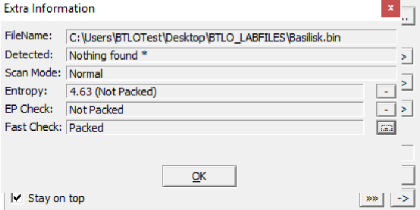

With this, we can see that we have an entropy of 4.63 and we can determine that this executable is not packed.

> *As such, the answer to Question 8 is:*

> *No, 4.63*

## Question 9: What is the SHA256 hash value of the Basilisk?

We simply run this command in PowerShell and we get:

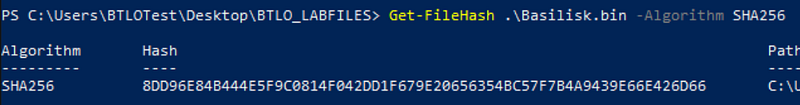

> *As such, the answer to Question 9 is:*

> *8DD96E84B444E5F9C0814F042DD1F679E20656354BC57F7B4A9439E66E426D66*

## Question 10: Using the PEView Tool, Can you identify when was Basilisk was made?

After opening the program, we are greeted with this:

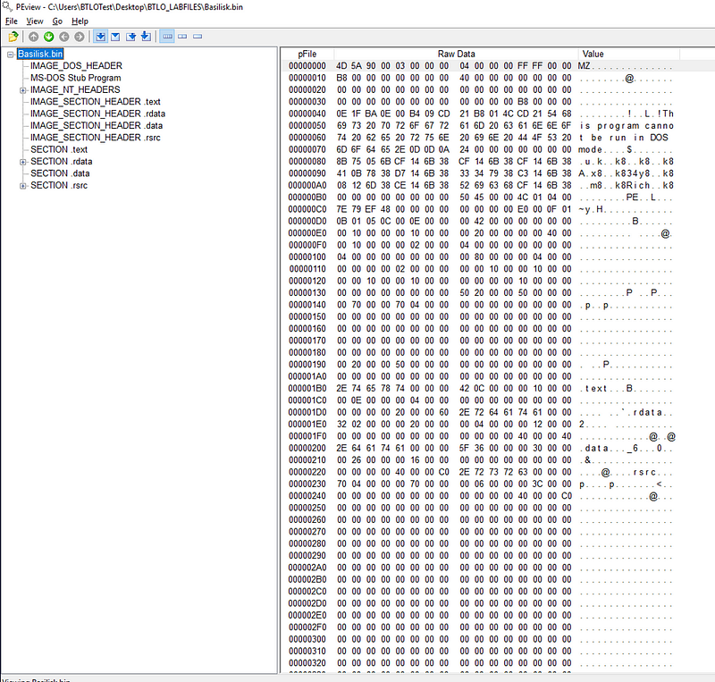

After digging around the file, in the IMAGE_NT_HEADERS \> IMAGE_FILE_HEADER there is the date: 2008/10/10 Fri 15:49:18 UTC.

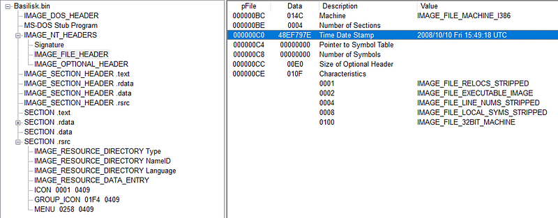

> *As such, the answer to Question 10 is:*

> *2008/10/10 Fri 15:49:18 UTC*

## Summary

Even though we did not really reverse engineer the program with tools such as IDA or Ghidra, we still learned some stuff about the workings of Windows, Windows APIs, how the computer memory works etc. We also played around the binaries of a Portable Executable (PE) and found how it is generally structured.
