# BTLO: Eradication

<!-- Original publication date: 2023-12-31 -->

## Introduction


Hello, my name is Sirbu-Boeti Eduard-Cristian and in this write-up I am going to cover the “Eradication” investigation on Blue Team Labs Online.

[**Blue Team Labs Online \| Eradication**<br><span>blueteamlabs.online</span>](https://blueteamlabs.online "https://blueteamlabs.online")

| Investigation detail | Description |
| --- | --- |
| Platform | Blue Team Labs Online |
| Investigation | Eradication |
| Difficulty | Easy |
| Primary evidence | A collected malware sample, generated YARA signatures, supplied IOCs, and files within two user home directories |
| Focus areas | Rule generation, recursive scanning, hash enrichment, custom rule design, and false-positive analysis |
| Tools demonstrated | YARA, yarGen, command-line utilities, and Joe Sandbox hash search |

### Scenario

A threat actor has compromised a system and hidden a number of files. The investigation requires generating a YARA rule from a collected sample, searching for related artifacts, and writing a second rule from a small set of supplied indicators.

The required files are located in the BTLO VM’s `Investigation` directory.

## Investigation approach

The workflow separates rule creation from rule validation:

1. Read the investigation instructions and identify the source sample and search locations.
2. Use yarGen to create a candidate signature from the collected sample.
3. Review the generated rule and scan each user directory, enabling recursion where required.
4. Extract the sample’s SHA-256 hash and use an existing sandbox report for contextual enrichment.
5. Translate the supplied indicators into a custom YARA rule.
6. Diagnose missed detections and false positives by inspecting which strings caused each match.

Throughout the process, the central questions are: **Why did this file match? Which part of the rule was satisfied? Does the match identify malware, or only a shared artifact?**

## Phase 1: Generate and validate a baseline rule

### Question 1: What is the full file path for the rule match in /John/?

The investigation begins with `README.txt`, which identifies the malware sample and the two user directories that must be searched.

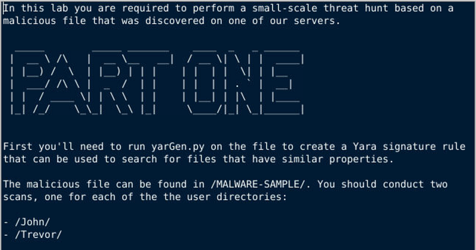

From the yarGen directory, generate a candidate rule from the supplied sample:

```bash
python3 yarGen.py -m /home/ubuntu/Desktop/Investigation/MALWARE-SAMPLE
```

yarGen writes the generated signatures to `yargen_rules.yar`:

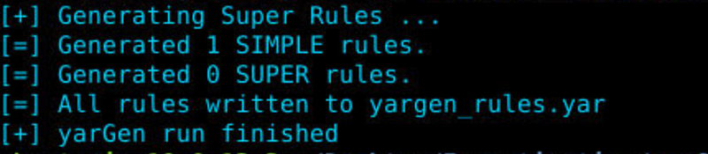

Before relying on an automatically generated rule, it should be reviewed for overly common strings and environmental assumptions. For this lab, the initial validation target is John’s home directory:

```bash
yara ../yarGen/yargen_rules.yar /home/John
```

The rule produces one direct match:

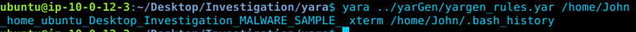

```text
/home/John/.bash_history
```

The match establishes that `.bash_history` contains content satisfying the generated rule. It does not establish that the history file is itself malware; the matching strings and their command context should be inspected to understand why the signature fired.

> **Finding:** `/home/John/.bash_history`

### Question 2: What is the full file path for the rule match in /Trevor/?

Applying the same rule to Trevor’s home directory initially returns no result:

```bash
yara ../yarGen/yargen_rules.yar /home/Trevor
```

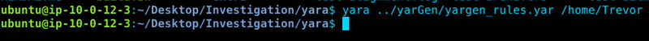

This result only describes the files examined at the current directory level. It does not exclude a match inside a nested directory.

The command-line help lists the available traversal and output options:

```bash
yara --help
```

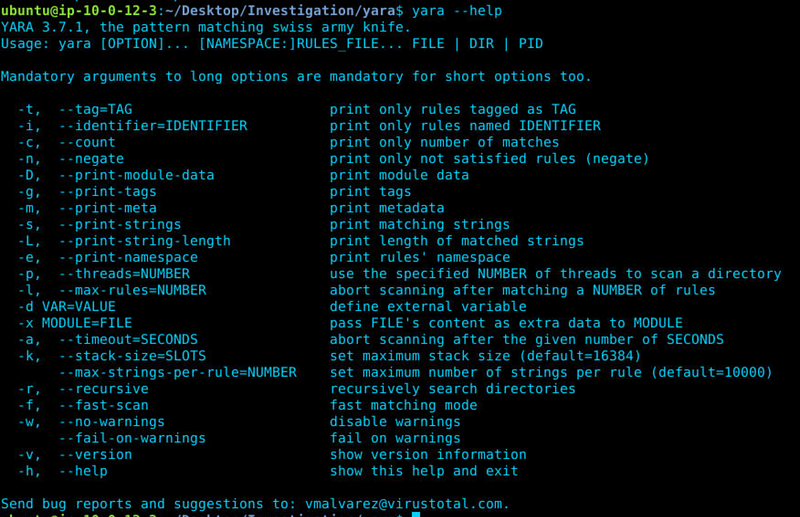

The `-r` option enables recursive directory scanning. Re-run the rule against Trevor’s directory with recursion enabled:

```bash
yara -r ../yarGen/yargen_rules.yar /home/Trevor
```

The recursive scan finds a match several levels below `Downloads`:

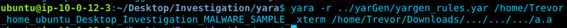

```text
/home/Trevor/Downloads/.../.../.../a.a
```

Recursion changes which files are visited; it does not change the rule’s detection logic. This distinction matters when comparing a clean result with a recursive scan result.

> **Finding:** `/home/Trevor/Downloads/.../.../.../a.a`

## Phase 2: Enrich the collected sample

### Question 3: Search the SHA256 hash (either obtained via CLI from the sample or from the yarGen created rule) and submit it to joesandbox.com — What is the malware’s name?

The generated rule includes the source sample’s SHA-256 value in its metadata. The same value could be calculated independently with `sha256sum` to verify that the rule and the collected sample refer to the same file.

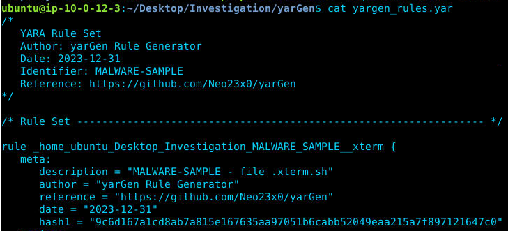

Searching the hash in Joe Sandbox returns an existing analysis report:

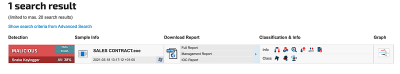

The report labels the sample as `Snake Keylogger`. This is useful enrichment, but a third-party family label should be treated as one source of context and corroborated with behavior, configuration, or additional detection results when making an operational determination.

> **Finding:** `Snake Keylogger`

> **Privacy consideration:** A hash lookup discloses less than uploading a file, but the hash and search activity can still reveal the existence of an investigation. Follow organizational policy before using a public analysis service.

## Phase 3: Build and tune a custom IOC rule

### Question 4: What is the full file path for the rule match in /John/?

Part Two replaces the generated signature with a custom rule built from supplied indicators: four strings and an expected maximum file size.

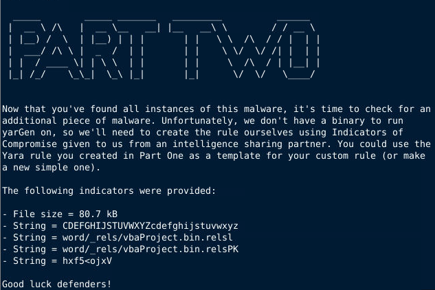

Using the [YARA rule syntax](https://yara.readthedocs.io/en/stable/writingrules.html), the indicators can be represented as named strings with a condition that requires every string and applies the size constraint:

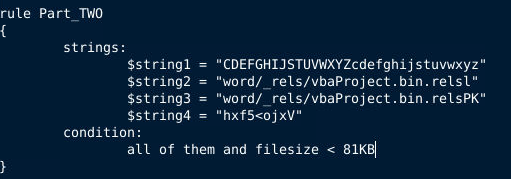

```yara
rule Part_TWO
{
    strings:
        $string1 = "CDEFGHIJSTUVWXYZcdefghijstuvwxyz"
        $string2 = "word/_rels/vbaProject.bin.rels1"
        $string3 = "word/_rels/vbaProject.bin.relsPK"
        $string4 = "hxf5<ojxV"

    condition:
        all of them and filesize < 81KB
}
```

Scanning John’s directory recursively produces a match:

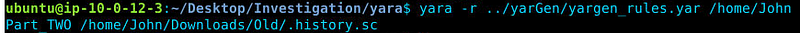

```text
/home/John/Downloads/Old/.history.sc
```

The result satisfies the rule as written: every listed string is present and the file is below the configured size threshold. A YARA match is still an indicator, not a final malware verdict; the file should be hashed and examined separately.

> **Finding:** `/home/John/Downloads/Old/.history.sc`

### Question 5: What is the full file path for the rule match in /Trevor/?

The original strict rule returns no match in Trevor’s directory:

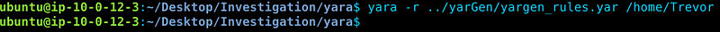

To diagnose the miss, the condition was temporarily broadened:

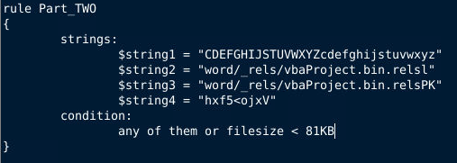

```yara
condition:
    any of them or filesize < 81KB
```

This is deliberately broad and should not be treated as a production condition. Because it uses `or`, every file below 81 KB matches even when none of the supplied strings is present. Running it recursively therefore produces several results:

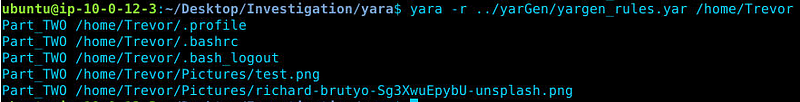

The `-s` option prints each matching string and its offset, making it possible to distinguish a string-based detection from a match caused only by the size branch:

```bash
yara -r -s ../yarGen/yargen_rules.yar /home/Trevor
```

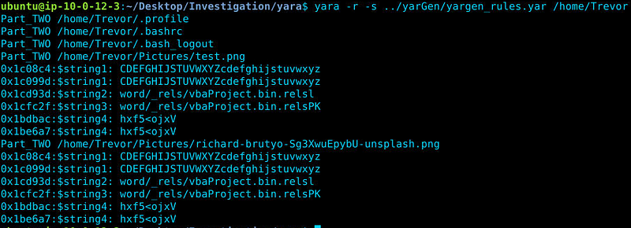

The shell profile files—`.profile`, `.bashrc`, and `.bash_logout`—produce no matching-string output, confirming that they were selected only because of their size. The PNG results contain the supplied strings and therefore warrant closer examination.

The room’s intended path is:

```text
/home/Trevor/Pictures/richard-brutyo-Sg3XwuEpybU-unsplash.png
```

> **Finding:** `/home/Trevor/Pictures/richard-brutyo-Sg3XwuEpybU-unsplash.png`

> **Evidence caveat:** The captured output also shows `test.png` containing the supplied strings. The broad diagnostic rule does not uniquely distinguish the intended file, so a defensible conclusion would compare hashes, metadata, string counts, file structure, and the original challenge context before prioritizing one image.

The correct lesson is not simply to make a rule less strict. Boolean changes should be deliberate:

- `all of them and filesize < 81KB` requires every string and the size constraint.
- `any of them and filesize < 81KB` requires at least one string and the size constraint, but may still be noisy.
- `any of them or filesize < 81KB` also matches every small file and is therefore unsuitable as a final detection rule.
- Removing or changing the size threshold should be based on validated samples rather than trial and error.

## Investigation outcome

| Stage | Result | Investigative value |
| --- | --- | --- |
| Generated rule | Matches under both John’s and Trevor’s home directories | Demonstrates how sample-derived signatures locate related artifacts |
| Hash enrichment | Existing report labels the source sample as Snake Keylogger | Adds external context to the collected sample |
| Custom IOC rule | Identifies hidden and image-based artifacts | Demonstrates translating supplied strings and size into YARA conditions |
| Rule tuning | Exposes size-only false positives | Demonstrates why match explanation is part of rule validation |

## Key takeaways

- Validate both the rule and the scan scope before interpreting a clean result.
- Use recursive scanning when the target may be hidden in nested directories.
- Print matching strings and offsets to explain why a rule fired.
- Treat automated signatures and sandbox labels as leads that require corroboration.
- Combine string and file constraints with `and` when both must be satisfied; understand how `or` broadens a rule.

## Additional resources

- [YARA: Running from the command line](https://yara.readthedocs.io/en/stable/commandline.html) — recursive scanning, matching-string output, and other command options.
- [YARA: Writing rules](https://yara.readthedocs.io/en/stable/writingrules.html) — strings, conditions, quantifiers, and the `filesize` variable.
- [Neo23x0/yarGen](https://github.com/Neo23x0/yarGen) — the rule-generation project used in the lab.
- [Joe Sandbox](https://www.joesandbox.com/) — hash search and automated malware-analysis reports.
