# BTLO: Phishy V1

<!-- Original publication date: 2023-12-31 -->

## Introduction

Difficulty: Easy

Scenario: You have been sent a phishing link — It is your task to investigate this website and find out everything you can about the site, the actor responsible, and perform threat intelligence work on the operator(s) of the phishing site.

Requirements: BTLO VM

Tools: Browser, Text Editor

Main File: “PHISY V1 READ ME”

## Question 1: The HTML page used on securedocument.net is a decoy. Where was this webpage mirrored from, and what tool was used?

When accessing the file on the Desktop, we are prompted to the following link:

*securedocument.net/secure/L0GIN/protected/login/portal/index1.html?1614546319649*

At first glance it’s a bad attempt at recreating a Microsoft page:

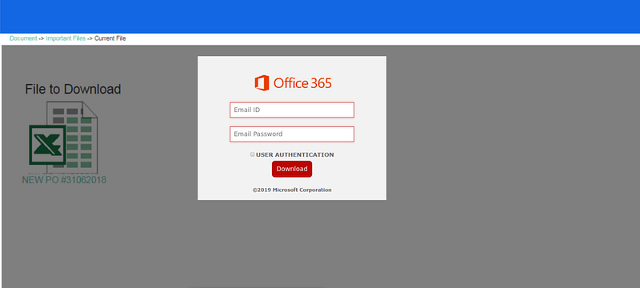

If we go directly to *securedocument.net* we see the following<em>:</em>

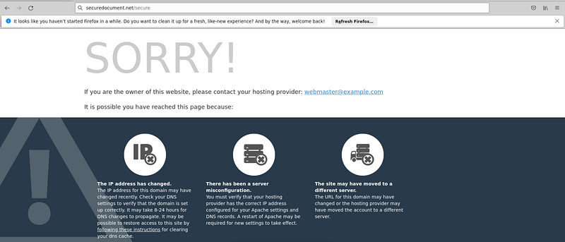

If we inspect the code of the page we get:

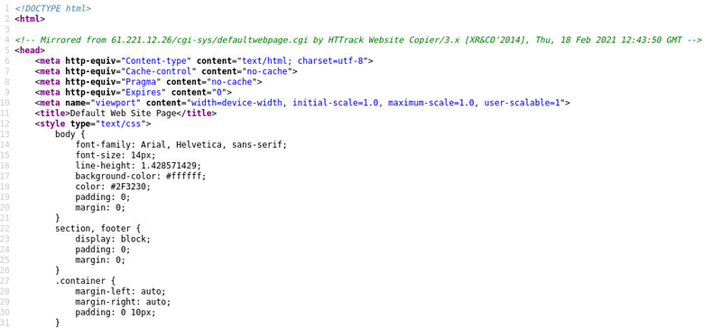

It appears that this page has been mirrored from the following site:

- *61.221.12.26/cgi-sys/defaultwebpage.cgi*

It also looks like they also used [HTTrack](https://www.httrack.com/).

> As such, the answer to Question 1 is:

> 61.221.12.26/cgi-sys/defaultwebpage.cgi, HTTrack

## Question 2: What is the full URL of the background image which is on the phishing landing page?

Let’s go back to the original link and we get the following if we inspect the web page:

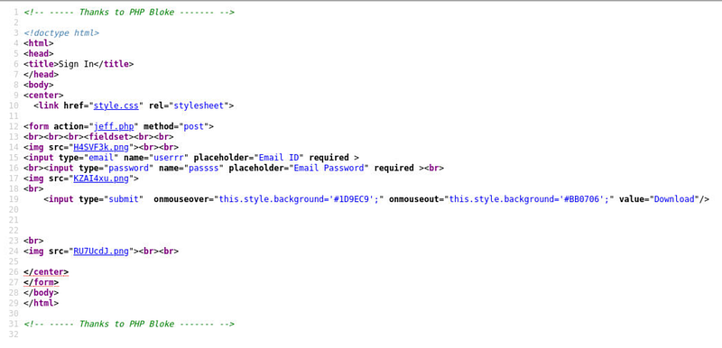

The background image of a web site is usually located in the *style.css* file. Here it is:

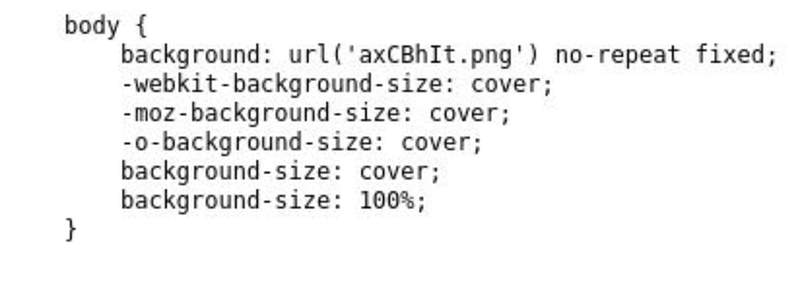

It seems the background image is stored locally and is in the same directory as the web page:

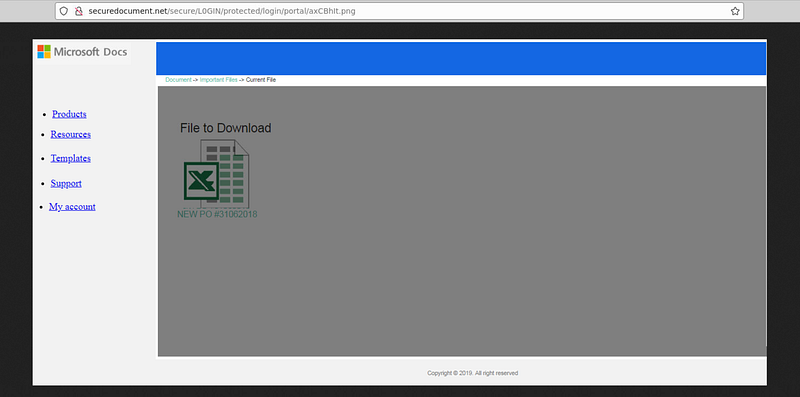

> As such, the answer to Question 2 is:

> <http://securedocument.net/secure/L0GIN/protected/login/portal/axCBhIt.png>

## Question 3: What is the name of the php page which will process the stolen credentials?

If we go back to the main phising page we can see that the form action is the following:

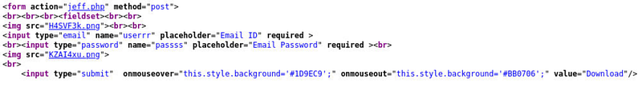

> As such, the answer to Question 3 is:

> jeff.php

## Question 4: What is the SHA256 of the phishing kit in ZIP format?

While snooping through the directories of this website we find the following:

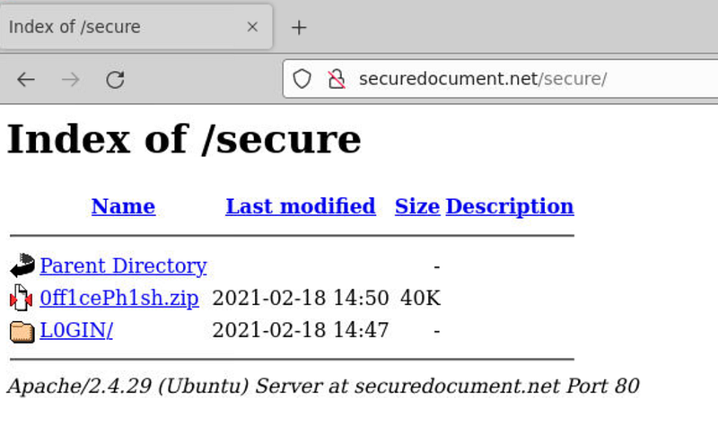

Let’s download it and get the hash:

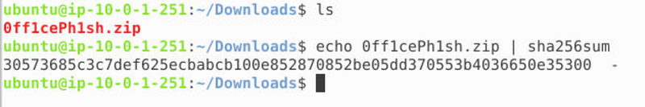

BTLO only wants from us the last 6 characters: fa5b48.

> As such, the answer to Question 4 is:

> fa5b48

## Question 5: What email address is setup to receive the phishing credential logs?

Let’s analyze the “jeff.php”:

It looks like he is trying to send the POST values through email to:

- *boris.smets@tfl-uk.co*

> As such, the answer to Question 5 is:

> boris.smets@tfl-uk.co

## Question 6: What is the function called to produce the PHP variable which appears in the index1.html URL?

If we look at the original phising URL:

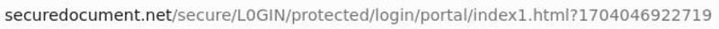

We can see that after “index1.html” there is “?1704046922719”. Now what could this be. If we read the question once more, it looks like we are being redirected and that output is generated. After digging through the website we find something interesting:

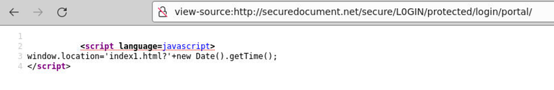

It looks like this is what that redirect does. It also seems to be using the function “.getTime()” to generate that weird output.

> As such, the answer to Question 6 is:

> getTime()

## Question 7: What is the domain of the website which should appear once credentials are entered?

After entering some false credentials we get the following:

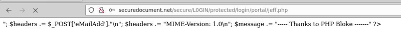

It looks like it’s broken. At least we know that after entering the credentials the “jeff.php” script was supposed to do something. Let’s go back to it:

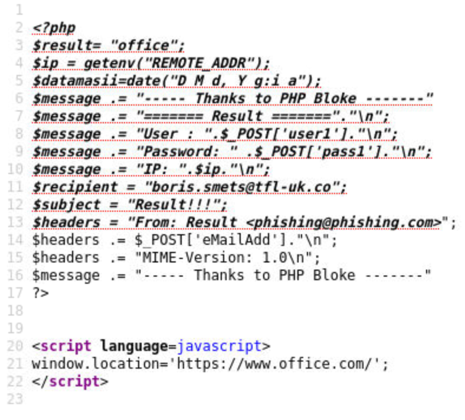

It seems that after running it, it was supposed to redirect us to *office.com.*

> As such, the answer to Question 7 is:

> office.com

## Question 8: There is an error in this phishing kit. What variable name is wrong causing the phishing site to break?

If we look closely at the “jeff.php” script it seems there is some weird formatting that is causing it to break. I can’t seem to figure out why, the syntax looks correct.

After some time, I’ve found something interesting:

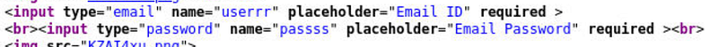

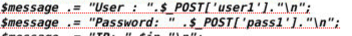

It looks like the guy who made this didn’t even though how passing variables through a POST request works :))

> As such, the answer to Question 8 is:

> userrr / passss / user1 / pass1

## Summary:

So far, we analyzed a poorly made phising website with incorrect code. Unfortunately, there still will be non-tech savvy people falling for this, especially if the redirect wasn’t broken.
