# BTLO: SOC Alpha 1

<!-- Original publication date: 2023-12-30 -->

## Introduction

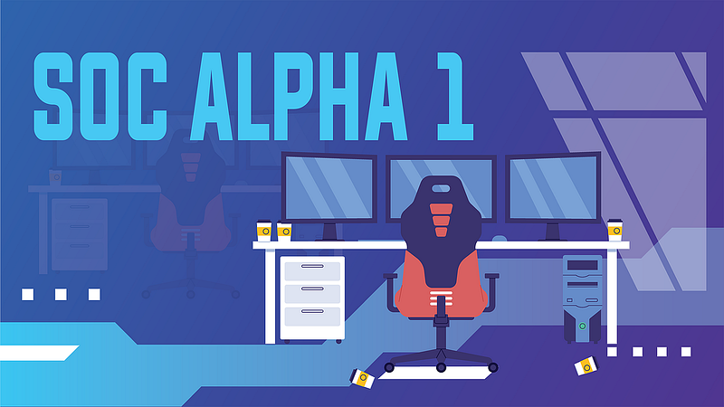

Hello, my name is Sirbu-Boeti Eduard-Cristian and in this write-up I am going to cover “SOC Alpha 1” on Blue Team Labs Online.

[**Blue Team Labs Online \| SOC Alpha 1**<br><span>blueteamlabs.online</span>](https://blueteamlabs.online/home/investigation/soc-alpha-1-2ba4c4a550 "https://blueteamlabs.online/home/investigation/soc-alpha-1-2ba4c4a550")

| Investigation detail | Description |
| --- | --- |
| Platform | Blue Team Labs Online |
| Investigation | SOC Alpha 1 |
| Primary evidence | Windows PowerShell and Sysmon events indexed in Elastic |
| Focus areas | Alert scoping, PowerShell download activity, file creation, Registry persistence, and scheduled tasks |
| Tools demonstrated | Kibana Discover, Elastic index patterns, Windows event logs, and Sysmon telemetry |

## Investigation approach

Each alert begins with three scoping details from `README.txt`: a time window, a data source or index pattern, and a detection rule. I use those details to reduce the dataset before interpreting individual events.

1. Record the alert’s stated time frame and use the correct time zone.
2. Select the index that contains the expected telemetry.
3. Apply the supplied rule as a starting filter, then inspect the matching event fields.
4. Identify the process, command line, file, Registry object, or scheduled task represented by the event.
5. Pivot into related events to connect execution with the resulting persistence artifact.
6. Keep observed facts separate from conclusions that still require corroboration.

Throughout the investigation, the central questions are: **What behavior triggered the alert? Which event field contains the evidence? What related telemetry would confirm the sequence?**

| Alert | Primary telemetry | Investigative objective |
| --- | --- | --- |
| Alert 1 | PowerShell events | Identify the download mechanism and source URL |
| Alert 2 | Sysmon file-creation events | Identify a payload placed in a Startup folder |
| Alert 3 | Sysmon Registry events | Identify a Run-key persistence entry and its executable |
| Alert 4 | Sysmon process events | Recover the scheduled-task name and target program |

## Phase 1: Trace the PowerShell download

### Question 1: Alert 1 (1/2) — What is the cmdlet used for downloading?

The first alert targets download behavior. Before searching the logs, it is important to distinguish a PowerShell cmdlet from a method exposed by the .NET runtime. A [cmdlet](https://learn.microsoft.com/en-us/powershell/scripting/developer/cmdlet/cmdlet-overview?view=powershell-7.4) is a command implemented specifically for the PowerShell environment.

The investigation begins with `README.txt` on the BTLO VM desktop. This file defines the alerts, candidate detection logic, data sources, and time windows that will guide the search.

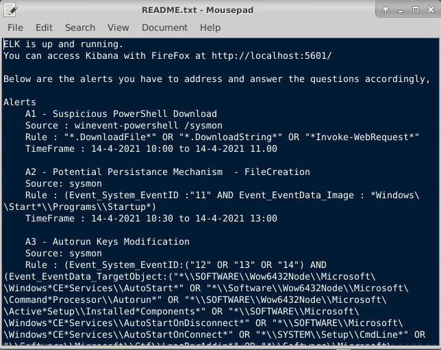

Alert 1 lists three candidate indicators:

- [`WebClient.DownloadFile`](https://learn.microsoft.com/en-us/dotnet/api/system.net.webclient.downloadfile?view=net-8.0) downloads a resource to a local file.
- [`WebClient.DownloadString`](https://learn.microsoft.com/en-us/dotnet/api/system.net.webclient.downloadstring?view=net-8.0) retrieves a resource as a string.
- [`Invoke-WebRequest`](https://learn.microsoft.com/en-us/powershell/module/microsoft.powershell.utility/invoke-webrequest?view=powershell-7.4) is a PowerShell cmdlet for sending HTTP and HTTPS requests.

The first two are [.NET](https://learn.microsoft.com/en-us/dotnet/core/introduction) methods, but PowerShell can still invoke them through a `System.Net.WebClient` object. `Invoke-WebRequest`, by contrast, is itself a cmdlet. The decisive evidence is therefore not the rule label but the command or script-block content recorded in the matching event.

### Question 2: Alert 1 (2/2) — What is the full URL from which the file is downloaded?

The next objective is to recover the source URL from the PowerShell telemetry. Inside the lab VM, Kibana is available at <http://localhost:5601/app/home#/>.

This interface provides access to the [Elastic Stack](https://www.elastic.co/elastic-stack) data collected for the investigation.

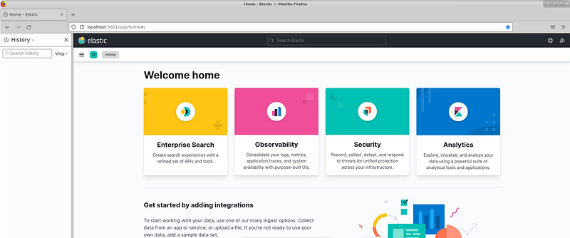

If the dashboard is unavailable in the VM, start the three lab services:

```bash
sudo systemctl start elasticsearch
sudo systemctl start kibana
sudo systemctl start logstash
```

Open **Analytics → Discover** to examine the indexed events. The initial view may show no results:

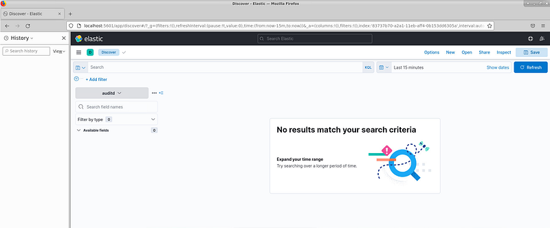

The empty result does not mean the evidence is absent. Kibana initially uses a recent relative time range, whereas this investigation’s events were generated in April 2021. The first analytical step is therefore to replace the relative range with the alert’s absolute time window.

The Alert 1 entry in `README.txt` supplies both the temporal scope and the relevant data source:

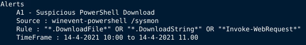

- TimeFrame: 14–4–2021 10:00 to 14–4–2021 11:00
- Source: winevent-powershell /sysmon

After applying the one-hour window, events become visible in Discover:

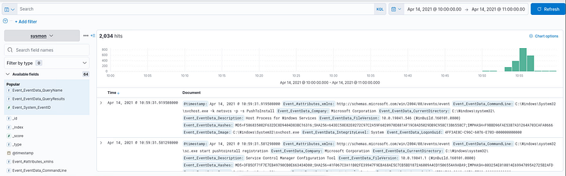

The time filter reduces the search space, but the result set is still too broad to answer the alert. Apply the supplied detection terms to the PowerShell dataset:

```text
"*.DownloadFile*" OR "*.DownloadString*" OR "*Invoke-WebRequest*"
```

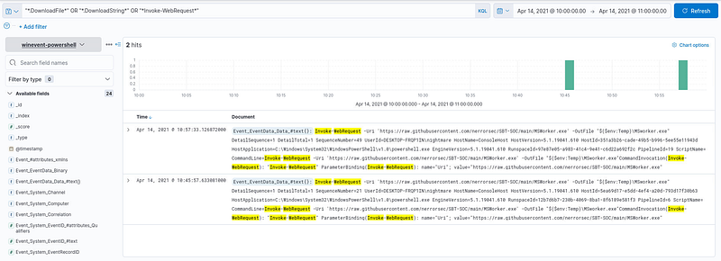

The index pattern must be `winevent-powershell`. The query is designed to match PowerShell content, so running it against the `sysmon` index will not return the expected events.

The filter narrows the dataset to two events. At this point, the investigation moves from search to interpretation: inspect the command content and identify the values passed to the web-request parameters.

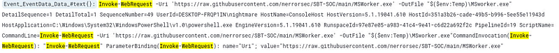

Both events contain the following defanged URL: \
hxxps\[://\]raw\[.\]githubusercontent\[.\]com/nerrorsec/SBT-SOC/main/MSWorker.exe

The command uses [`Invoke-WebRequest`](https://learn.microsoft.com/en-us/powershell/module/microsoft.powershell.utility/invoke-webrequest?view=powershell-7.4#parameters). Its `-Uri` value identifies the remote source, while `-OutFile` records where PowerShell attempted to write the response. A complete timeline would also capture the event timestamp, user, host, process identifier, destination path, and any later file-creation or process-execution event.

The two events appear to contain the same command, but visual similarity alone is not enough to classify them as duplicates. They may originate from different PowerShell logging channels or ingestion paths, so event IDs, record IDs, timestamps, and source fields should be compared before deduplication.

## Phase 2: Correlate the download with Startup-folder persistence

### Question 3: Alert 2 (1/1) — What is the name of the suspicious EXE that is added for Persistence?

The PowerShell command from Alert 1 specifies a destination under the Windows temporary directory. Alert 2 tests whether that file was subsequently copied or written into an autostart location.

The alert definition scopes the search to Sysmon file-creation telemetry and paths containing the Windows Startup directory:

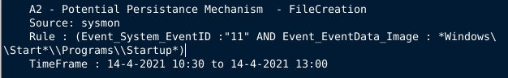

- Index pattern: sysmon
- Search filter: (Event_System_EventID :”11" AND Event_EventData_Image : \*Windows&#92;&#92;Start\*&#92;&#92;Programs&#92;&#92;Startup\*)
- TimeFrame: 14–4–2021 10:30 to 14–4–2021 13:00

[Sysmon Event ID 11](https://learn.microsoft.com/en-us/sysinternals/downloads/sysmon#event-id-11-filecreate) records file creation or overwrite activity. Applying the alert’s index, time window, and path filter produces the following result:

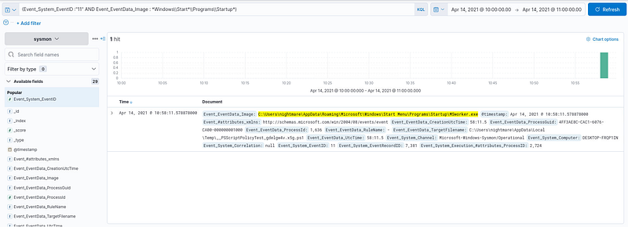

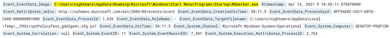

The event identifies `MSworker.exe` in the Windows [Startup folder](https://support.microsoft.com/en-us/windows/add-an-app-to-run-automatically-at-startup-in-windows-10-150da165-dcd9-7230-517b-cf3c295d89dd). Files in this location are launched when the associated user signs in, making the write a strong persistence indicator. The event proves that the file was created or overwritten; it does not, by itself, prove that the executable later ran.

> **Correlation step:** Compare the filename and path with the earlier PowerShell `-OutFile` value. Then look for a matching hash, process-creation event, or network connection to strengthen the link between download and persistence.

This behavior maps to [MITRE ATT&CK T1547.001: Registry Run Keys / Startup Folder](https://attack.mitre.org/techniques/T1547/001/).

## Phase 3: Investigate Registry Run-key persistence

### Question 4: Alert 3 (1/2) — What is the name of the suspicious executable file involved?

Alert 3 investigates a different persistence mechanism: modification of an autostart location in the Windows Registry. The `README.txt` entry defines the relevant Sysmon Registry event IDs, candidate autorun paths, and time window:

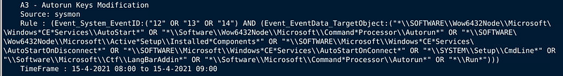

- Index pattern: sysmon
- Event IDs: 12, 13, and 14
- Target objects: known autorun locations, including Registry paths containing `Run`
- Time frame: 15–4–2021 08:00 to 15–4–2021 09:00

The supplied rule covers several autorun locations. For this question, the relevant conditions can be isolated into a smaller hypothesis-driven query:

```text
Event_System_EventID:("12" OR "13" OR "14")
AND Event_EventData_TargetObject:*\\Run\\*
```

This filter asks a specific question: which Registry create, set, delete, or rename events affected a Run-style autostart path during the alert window? Applying that logic produces the following events:

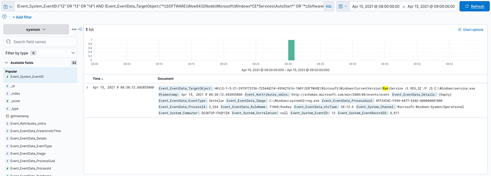

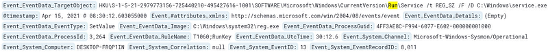

[Sysmon Event ID 12](https://learn.microsoft.com/en-us/sysinternals/downloads/sysmon#event-id-12-registryevent-object-create-and-delete) covers Registry object creation and deletion, [Event ID 13](https://learn.microsoft.com/en-us/sysinternals/downloads/sysmon#event-id-13-registryevent-value-set) covers value changes, and [Event ID 14](https://learn.microsoft.com/en-us/sysinternals/downloads/sysmon#event-id-14-registryevent-key-and-value-rename) covers key or value renaming.

The matching event shows `service.exe` being written beneath a [Windows Run key](https://learn.microsoft.com/en-us/windows/win32/setupapi/run-and-runonce-registry-keys). This is the significant relationship: the target object identifies the autostart entry, while the Registry data identifies the executable that entry will launch.

The recorded `reg add` command uses the following parameters:

- `/t REG_SZ` selects a [null-terminated string](https://learn.microsoft.com/en-us/windows/win32/shell/hkey-type) value.
- `/d C:\Windows\service.exe` supplies the executable path stored as the value data.
- `/f` writes the value without an interactive confirmation prompt.

The full [`reg add` syntax](https://learn.microsoft.com/en-us/windows-server/administration/windows-commands/reg-add) confirms how these parameters combine. Recording the entire command is more useful than extracting only the filename because it preserves the target, data type, value data, and overwrite behavior.

### Question 5: Alert 3 (2/2) — What is the name of the key path?

Windows Registry data is organized into [keys, subkeys, and named values](https://learn.microsoft.com/en-us/windows/win32/sysinfo/structure-of-the-registry). The event’s target-object field provides the complete location:

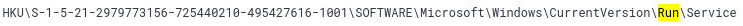

The final component is `Service`.

In precise Registry terminology, `Run` is the key and `Service` is the value name appended to the event’s target-object path. Preserving the complete path avoids ambiguity about the hive, user SID, persistence key, and value involved.

## Phase 4: Recover scheduled-task persistence

### Question 6: Alert 4 (1/2) — What is the name of the task?

Alert 4 examines scheduled-task creation. The lab definition again provides the data source, process and command-line conditions, and time window:

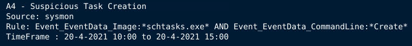

- Index pattern: sysmon
- Search filter/rule: Event_EventData_Image:\*schtasks.exe\* AND Event_EventData_CommandLine:\*Create\*
- Time frame: 20–4–2021 10:00 to 20–4–2021 15:00

The query looks for `schtasks.exe` processes whose command line contains `Create`. After applying the absolute time range and inspecting the matching event, the complete task-creation command becomes visible:

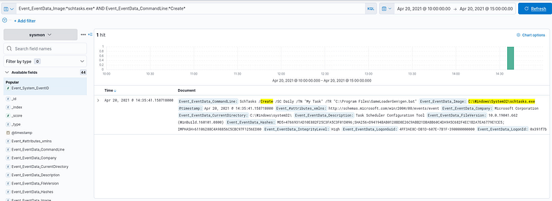

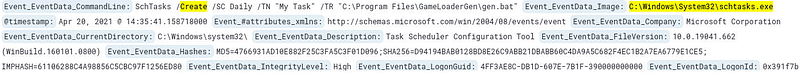

Windows [`SchTasks`](https://learn.microsoft.com/en-us/windows-server/administration/windows-commands/schtasks) manages scheduled tasks. In this event, [`SchTasks Create`](https://learn.microsoft.com/en-us/windows-server/administration/windows-commands/schtasks-create) is invoked with three parameters that describe the persistence object:

| Parameter | Recorded value | Meaning |
| --- | --- | --- |
| `/SC` | `Daily` | Run the task every day |
| `/TN` | `My Task` | Assign the scheduled task’s name |
| `/TR` | `C:\Program Files\GameLoaderGen\gen.bat` | Define the program or script to execute |

The full command line ties the persistence mechanism together: `/Create` defines the action, `/SC` supplies the schedule, `/TN` names the task, and `/TR` identifies what the task will execute. In a production investigation, I would also record the parent process, user, integrity level, hashes, and any Task Scheduler operational events.

This behavior maps to [MITRE ATT&CK T1053.005: Scheduled Task](https://attack.mitre.org/techniques/T1053/005/).

### Question 7: Alert 4 (2/2) — What is the full path of the program?

The `/TR` field contains the requested program path:

```text
C:\Program Files\GameLoaderGen\gen.bat
```

The task name and target path should be reported separately. The task name identifies the persistence object, while `/TR` identifies the executable or script that Windows will launch when the trigger conditions are met.

## Investigation outcome

The four alerts describe one download mechanism and three Windows persistence mechanisms. They are supported by different telemetry and should be reported separately.

For Alerts 1 and 2:

- PowerShell invoked `Invoke-WebRequest` with a remote URI and local output path.
- Sysmon recorded `MSworker.exe` being written to a Startup folder.

For Alert 3:

- A Registry value named `Service` was configured beneath a Run key to reference `C:\Windows\service.exe`.

For Alert 4:

- `schtasks.exe` created a daily task named `My Task` that launches `C:\Program Files\GameLoaderGen\gen.bat`.

## Findings and analytical flow

| Stage | Observed artifact | What it establishes | Suggested corroboration |
| --- | --- | --- | --- |
| Download | PowerShell event containing `Invoke-WebRequest`, `-Uri`, and `-OutFile` | A command attempted to retrieve content and write it to disk | File hash, Sysmon FileCreate, proxy, DNS, or network telemetry |
| Startup persistence | Sysmon Event ID 11 in a Startup path | An executable was created or overwritten in an autostart location | Process creation after logon and matching file hash |
| Registry persistence | Sysmon Event ID 13 under a Run path | A Registry value was set to reference an executable | Full target object, value data, user SID, and subsequent execution |
| Scheduled-task persistence | `schtasks.exe /Create` command line | A named recurring task was configured with a target program | Task Scheduler events, task XML, and execution history |

The most useful investigative pivot is the relationship between artifacts. The PowerShell event identifies a source and destination; the file-creation event shows a similarly named executable entering an autostart location; the Registry and scheduled-task events reveal two additional persistence paths. Each event answers one part of the sequence, while correlation makes the overall conclusion stronger.

## Key takeaways

- Start every alert with its time frame, data source, and rule before searching broadly.
- Select the correct index pattern; a valid query against the wrong dataset can appear to have no evidence.
- Read the entire command line and distinguish source indicators, destination paths, object names, and value data.
- Use Sysmon event semantics to describe what the telemetry proves—and what it does not prove.
- Correlate execution, file, Registry, and task artifacts instead of treating alerts as isolated answers.

## Additional resources

- [Microsoft: PowerShell cmdlet overview](https://learn.microsoft.com/en-us/powershell/scripting/developer/cmdlet/cmdlet-overview) — the structure and behavior of PowerShell cmdlets.
- [Microsoft: Invoke-WebRequest](https://learn.microsoft.com/en-us/powershell/module/microsoft.powershell.utility/invoke-webrequest) — cmdlet syntax and parameters, including `-Uri` and `-OutFile`.
- [Microsoft Sysinternals: Sysmon](https://learn.microsoft.com/en-us/sysinternals/downloads/sysmon) — official descriptions of file, Registry, and process event IDs.
- [Microsoft: Run and RunOnce Registry keys](https://learn.microsoft.com/en-us/windows/win32/setupapi/run-and-runonce-registry-keys) — Windows autostart behavior for Run keys.
- [Microsoft: Schtasks.exe](https://learn.microsoft.com/en-us/windows/win32/taskschd/schtasks) — scheduled-task command syntax and parameters.
- [MITRE ATT&CK T1547.001](https://attack.mitre.org/techniques/T1547/001/) — Registry Run Keys and Startup Folder persistence.
- [MITRE ATT&CK T1053.005](https://attack.mitre.org/techniques/T1053/005/) — Scheduled Task persistence.
