# TryHackMe — Disk Analysis & Autopsy

<!-- Original publication date: 2024-03-11 -->

## TryHackMe Room

<https://tryhackme.com/room/autopsy2ze0>

## **What is the MD5 hash of the E01 image?**

Accessing the Case Files we can find the MD5 Hash in the HASAN2.E01

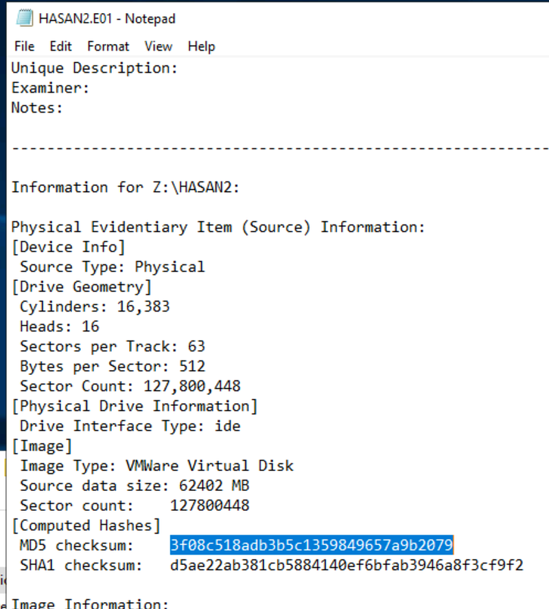

## **What is the computer account name?**

Accessing Results \> Operating System Information we get the computer name

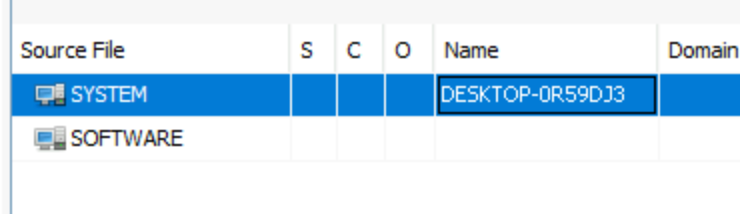

**List all the user accounts. (alphabetical order)**

Moving to Operating System User Account we get

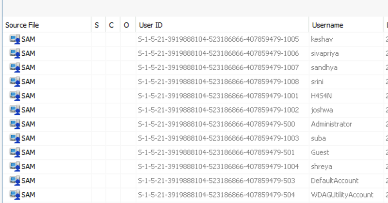

## **Who was the last user to log into the computer?**

Sorting by Date Accessed we get

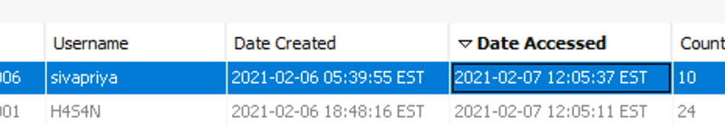

## **What was the IP address of the computer?**

After searching through the SYSTEM registry to no avail. I came across this article: <https://www.exploit-db.com/docs/48254>

As such, I searched for ProgramFile (x86)&#92;Look@Lan&#92;irunin.ini

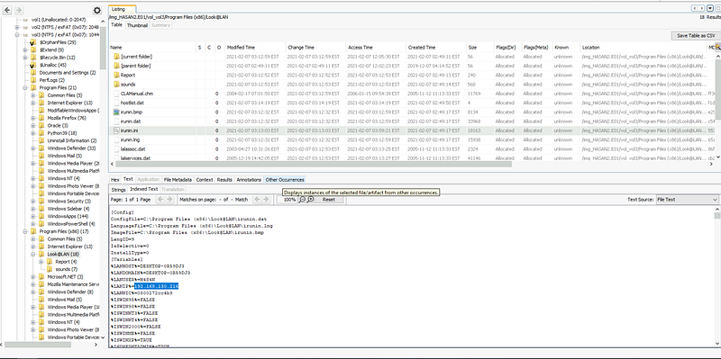

## **What was the MAC address of the computer? (XX-XX-XX-XX-XX-XX)**

The MAC address is on the next line of the above picture

## **What is the name of the network card on this computer?**

According to the article, we can find it in WINDOWS&#92;system32&#92;config&#92;software&#92;Microsoft&#92;Windows NT&#92;CurrentVersion&#92;NetworkCards&#92;

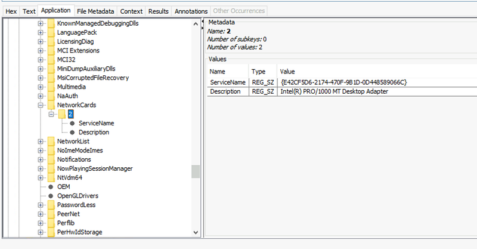

## What is the name of the network monitoring tool?

We found the IP and MAC of the NIC in “Look@Lan”

## A user bookmarked a Google Maps location. What are the coordinates of the location?

Going to Results \> Web Bookmarks we can find it

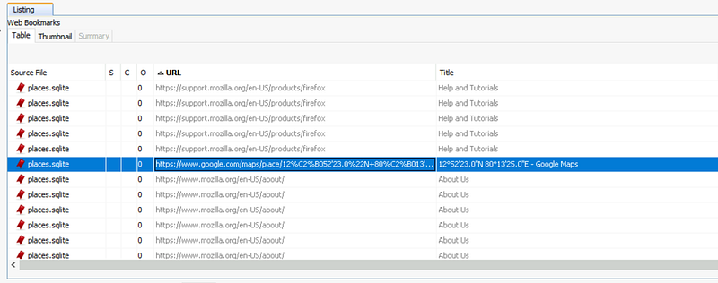

## A user has his full name printed on his desktop wallpaper. What is the user’s full name?

According to <https://www.makeuseof.com/find-desktop-wallpapers-file-location-windows-11/>

We can find the wallpaper at

`%AppData%\Microsoft\Windows\Themes\CachedFiles`

All we have to do now is to search every user and find it

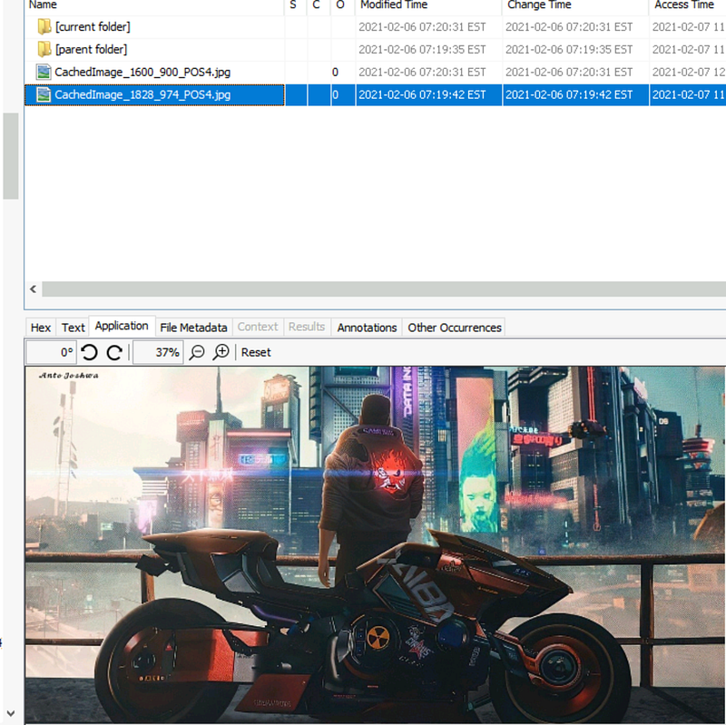

Because the name was written very small in the upper left corner, it took me some tries to finally find it

## A user had a file on her desktop. It had a flag but she changed the flag using PowerShell. What was the first flag?

After searching in every users’ Desktop we find

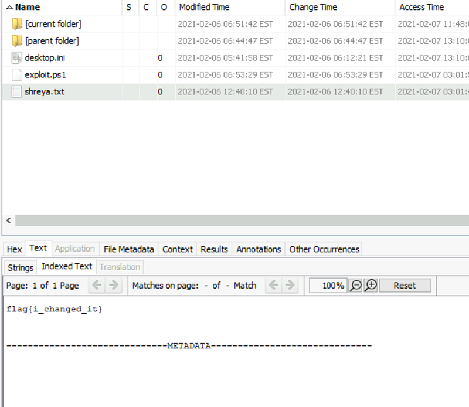

After searching for this file’s name we find some console history

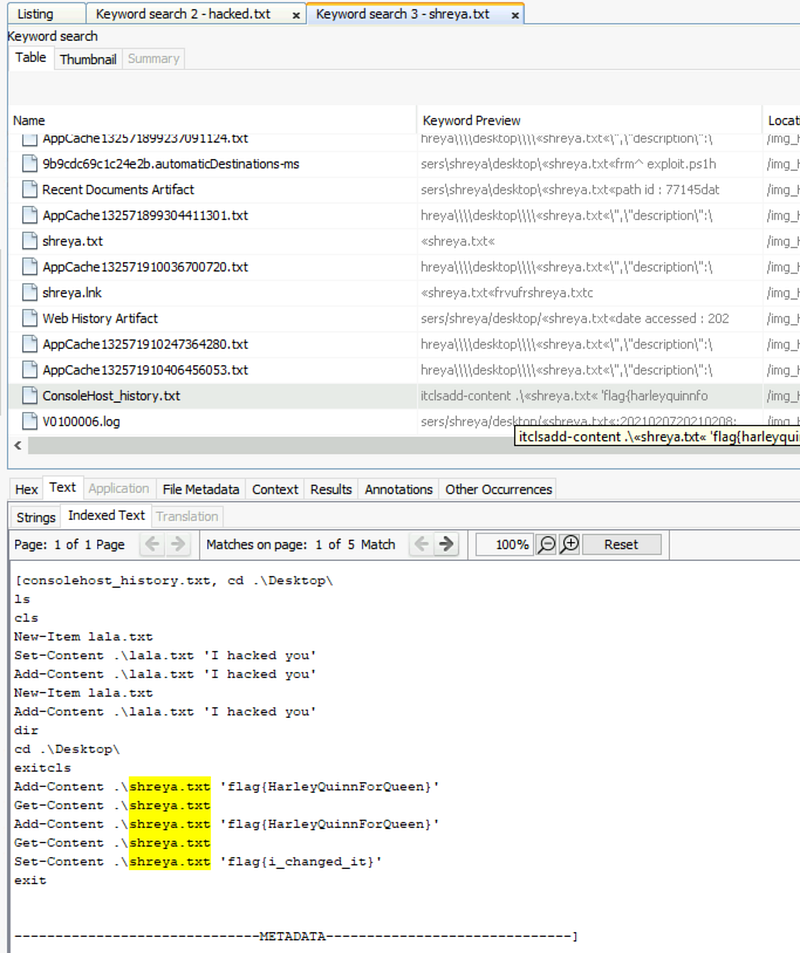

## **The same user found an exploit to escalate privileges on the computer. What was the message to the device owner?**

Looking at the same user, there is a Powershell script with a Youtube link to privilege escalation, along with the flag

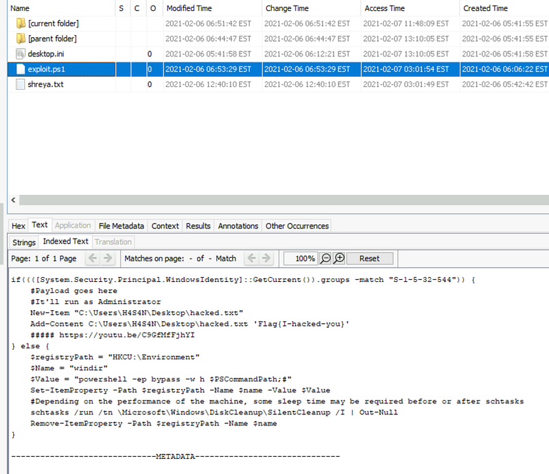

## 2 hack tools focused on passwords were found in the system. What are the names of these tools? (alphabetical order)

As I already know Mimikatz is a popular one, I search for it and get

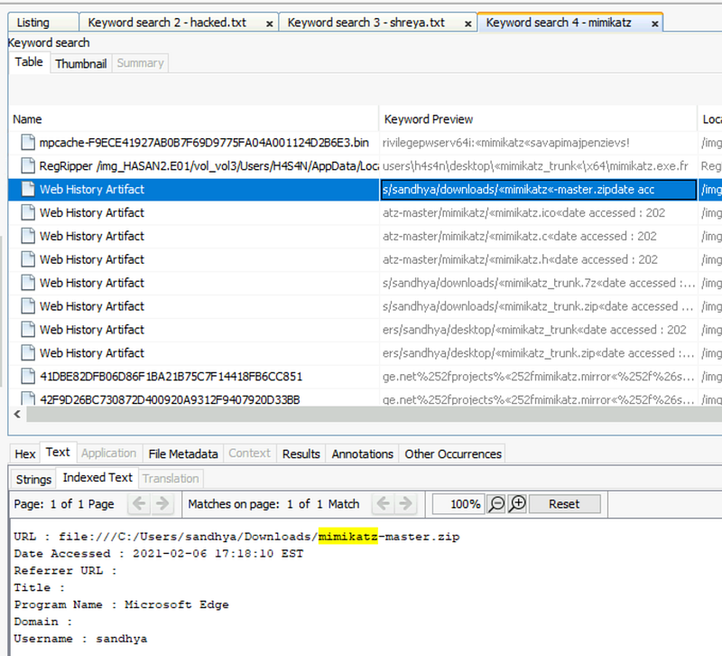

Looking at <https://attack.mitre.org/software/> I try searching for password hacking tools and eventually get

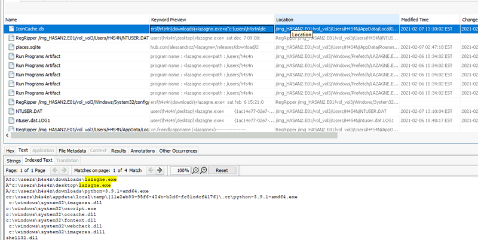

## There is a YARA file on the computer. Inspect the file. What is the name of the author?

Searching using regex “.\*&#92;.yar” we get

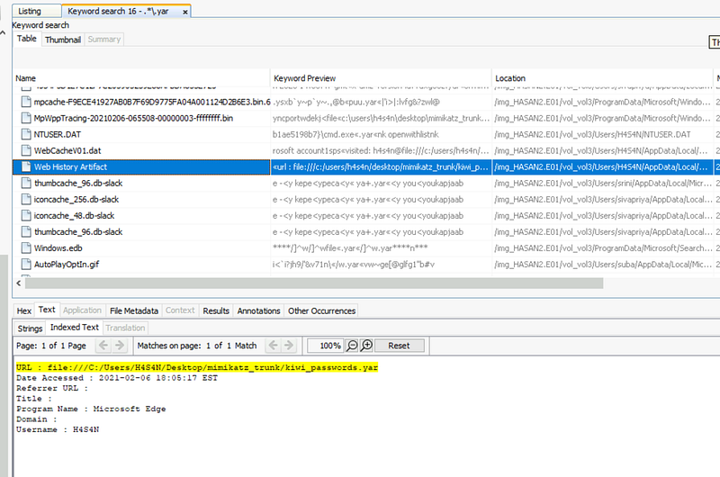

After searching for the file we can get the author

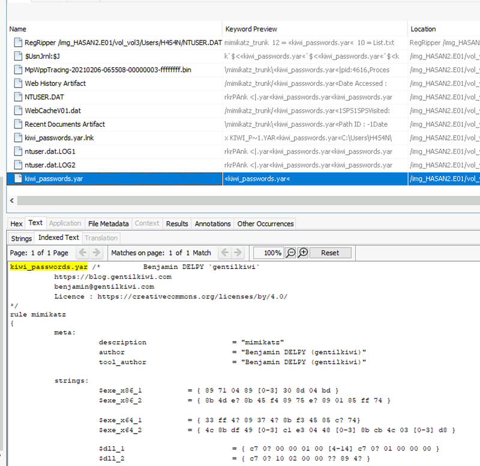

## One of the users wanted to exploit a domain controller with an MS-NRPC based exploit. What is the filename of the archive that you found? (include the spaces in your answer)

Searching for this exploit (<https://0xbandar.medium.com/detecting-the-cve-2020-1472-zerologon-attacks-6f6ec0730a9e>) we find out another name for it, “Zerologon”

If we try to search for it

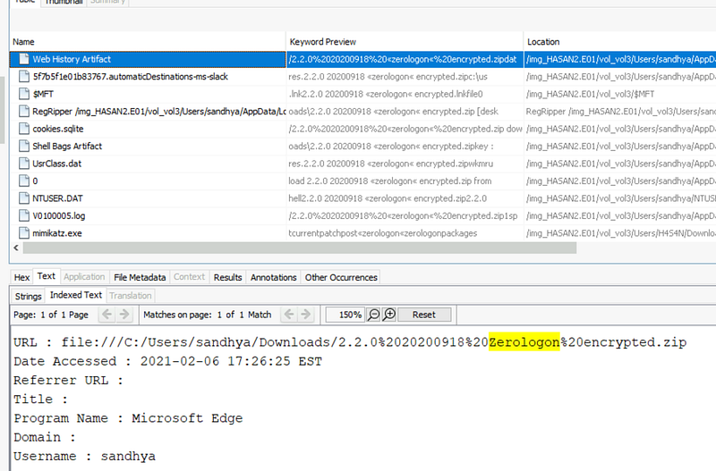

We also know that %20 is “ “
