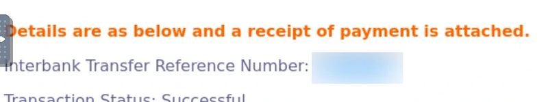
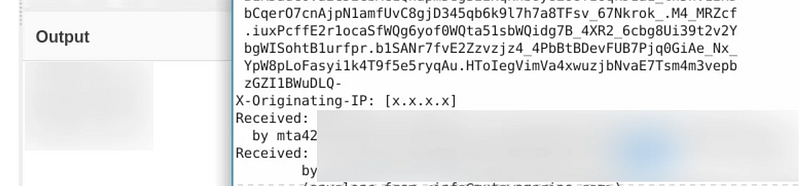
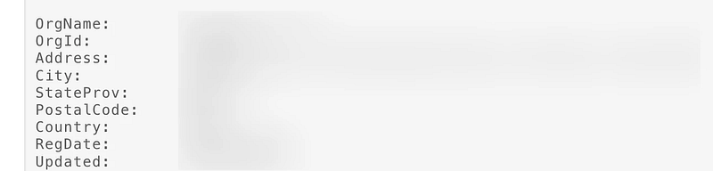
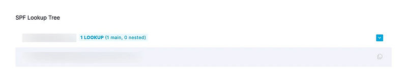
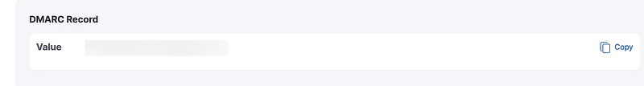
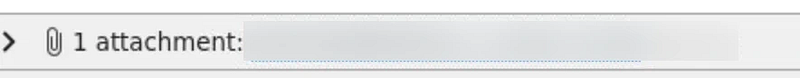
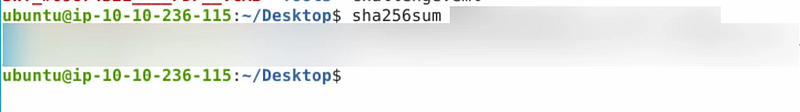
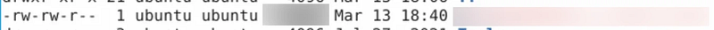
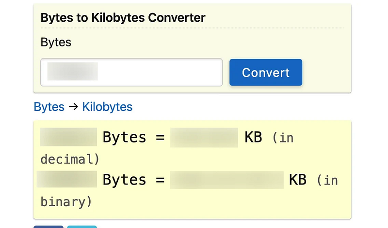
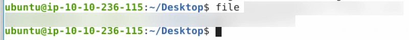

# TryHackMe — The Greenholt Phish

<!-- Original publication date: 2024-03-13 -->

## Introduction

Hello, my name is Eduard Boeti and in this write-up I am going to cover “The Greenholt Phish” room on [tryhackme.com](https://tryhackme.com)

[**TryHackMe \| The Greenholt Phish** *TryHackMe is a free online platform for learning cyber security, using hands-on exercises and labs, all through your…*tryhackme.com](https://tryhackme.com/room/phishingemails5fgjlzxc "https://tryhackme.com/room/phishingemails5fgjlzxc")

## 1. What is the **Transfer Reference Number** listed in the email’s **Subject**?

Simply open the email and check it:

## 2. Who is the email from?

## 3. What is his email address?

## 4. What email address will receive a reply to this email?

We can get all the info from the headers of the email:

## 5. What is the Originating IP?

Using Cyberchef to extract IPs and checking the source email file we get:

## 6. Who is the owner of the Originating IP? (Do not include the “.” in your answer.)

Using <https://whois.domaintools.com> on the previous IP we get:

## 7. What is the SPF record for the Return-Path domain?

First let’s find the Return-Path in the source of the email:

Next, using <https://easydmarc.com/tools/spf-lookup> we can get the SPF record:

## 8. What is the DMARC record for the Return-Path domain?

Using the same website as above, but with the DMARC checking service we get:

## 9. What is the name of the attachment?

We can see the attachment here at the bottom of the mail:

## 10. What is the SHA256 hash of the file attachment?

Going to terminal and using sha256sum on the file attachment we get:

## 11. What is the attachments file size? (Don’t forget to add “KB” to your answer, **NUM KB**)

Paying attention to the following: “**The binary system measures a kilobyte as 1,024 bytes, whereas the decimal system measures a kilobyte as an even 1,000 bytes**.”

We shall take the binary system measurement. But before this we get the number of bytes

## 12. What is the actual file extension of the attachment?

Using the “file” command we can get the true file type

