# Real-Life Phishing Analysis: Romanian Post and SwissPass

<!-- Original publication date: 2024-02-12 -->

## Introduction

On February 12, 2024, I investigated an SMS message impersonating the Romanian Post Office and preserved its redirect chain. While examining other phishing activity hosted on the same platform, I identified a separate SwissPass-themed deployment with an exposed source archive. The detailed source-code analysis in this report concerns that SwissPass deployment.

The investigation began with a Reddit post that shared the SMS message.

The two deployments used different `codeanyapp.com` subdomains. [Codeanywhere documented](https://codeanywhere.com/blog/ssl-and-friendly-preview-url-for-all) assigning hosted containers individual subdomains in the form `CONTAINERNAME-USERNAME.codeanyapp.com`, so their shared parent domain does not establish a common operator, campaign, or phishing kit. The [Swiss National Cyber Security Centre's 2023 report](https://www.ncsc.admin.ch/dam/ncsc/en/dokumente/dokumentation/fachberichte/bacs-bericht-antiphishing-2023_en.pdf.download.pdf/bacs-bericht-antiphishing-2023_en.pdf) recorded 201 phishing pages on the platform that year.

This is a retrospective, defensive analysis of infrastructure and artifacts observed in February 2024. URLs are defanged where appropriate, and historical infrastructure should not be treated as currently malicious without fresh validation.

## Initial lure and redirect chain

**Observation.** The SMS impersonated the Romanian Post Office and requested a payment of 1.98 RON for delivery of a parcel.

**Assessment.** This is a smishing lure: a phishing attempt delivered by SMS. The small payment and parcel-delivery pretext were likely intended to create urgency while making the request appear routine.

The first-hop domain, qrco[.]de, was used as a URL shortener. The service is associated with qr-code-generator.com, whose historical WHOIS record showed that the underlying service predated this campaign by many years. This suggests that a legitimate shortening service was abused rather than created specifically for the campaign.

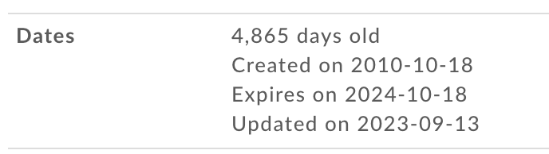

*Figure 1. Historical registration information for the domain associated with the URL-shortening service.*

The shortened URL redirected to:

*hxxps://servico-secured2-caitlinaloisio91163387[.]codeanyapp[.]com/posta_romania/POSTA-ROMANA/auth/billing.php*

The page was removed during the investigation, but the following information was preserved:

| Detail | Observed value |
| --- | --- |
| First-hop URL | hxxps://qrco[.]de/bemy6F |
| First-hop domain | qrco[.]de |
| First-hop IP | 18.173.187.98 |
| Final hostname | servico-secured2-caitlinaloisio91163387[.]codeanyapp[.]com |
| Final IP | 45.55.112.74 |
| `codeanyapp.com` registration | July 4, 2016 at 14:54:28 UTC |
| Registrar | GoDaddy.com, LLC |
| Romanian-page server header | OpenResty |
| Exposed administration component | `f9.php`, identified as the [alexantr/filemanager](https://github.com/alexantr/filemanager) PHP file manager |

The preserved [urlscan.io result](https://urlscan.io/result/e08bcda0-2970-4ab9-94fd-06d4c00610f5/) contains the redirect evidence and [associated indicators](https://urlscan.io/result/e08bcda0-2970-4ab9-94fd-06d4c00610f5/#indicators). Its first-hop address resolved to Amazon CloudFront infrastructure, while the final address belonged to the shared hosting environment. Neither address should be treated as an operator-owned system without additional evidence.

## Pivot to a separate deployment

After the first page was taken down, I searched urlscan.io for other phishing activity on the same hosting platform. This identified a separate page impersonating SwissPass, a service associated with Swiss public transport.

The related [urlscan.io result](https://urlscan.io/result/e424d301-e45b-417d-8553-575c7b3027f9/) and [VirusTotal URL record](https://www.virustotal.com/gui/url/3d0b81c3e12cfbe5ca5f27ca6f42f791cdd2671bbf48d8b5b5759089f8bcfb8b?nocache=1) provided an additional source of preserved infrastructure evidence.

**Observation.** The page reproduced SwissPass branding and presented a sequence of forms requesting account, payment-card, and SMS-verification information.

**Assessment.** The SwissPass page was independently consistent with phishing and appeared to use a reusable kit. Its presence on another `codeanyapp.com` subdomain was a useful research pivot, but it was not evidence that it shared an operator with the Romanian Post lure.

## Phase 1 — Reconstructing the collection flow

I examined the page from an isolated Kali Linux environment.

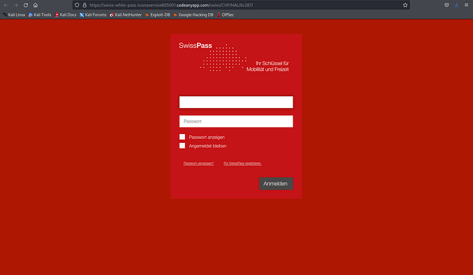

*Figure 2. Initial SwissPass-themed page requesting an email address and password.*

To document the requests generated by the page, I routed the browser traffic through Burp Suite.

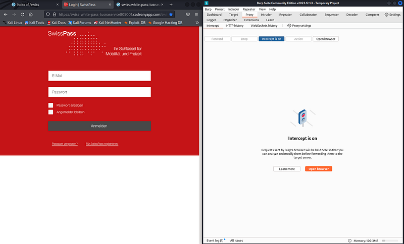

*Figure 3. Test environment used to observe the form submission through Burp Suite.*

Synthetic credentials were entered to observe the request without using real personal information.

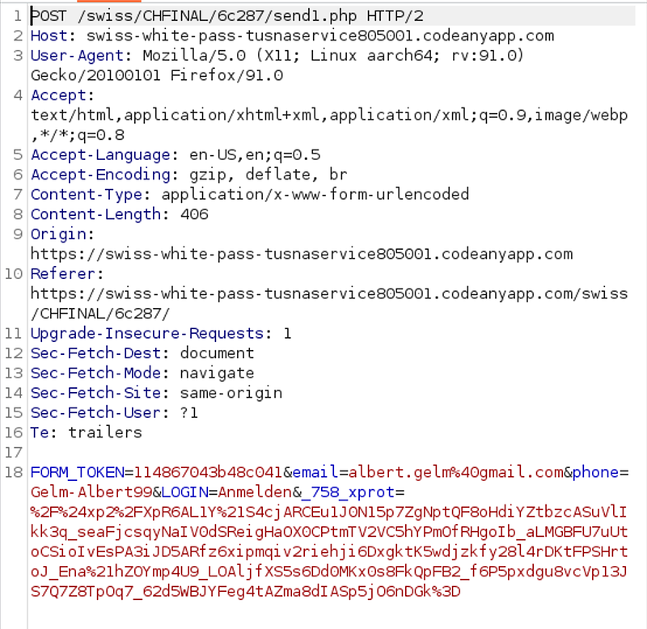

*Figure 4. Intercepted request to `send1.php`. The password value was assigned to a misleading field named `phone`.*

**Observation.** The first form submitted data to `send1.php` and then redirected the browser to `2.html`. The submitted email was stored in a field named `email`, while the password was stored in a field named `phone`.

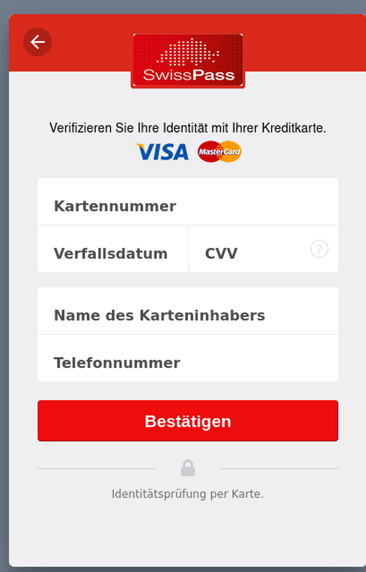

*Figure 5. Second-stage form requesting payment-card information.*

The second stage requested payment-card information. Synthetic cardholder data was used for the observation.

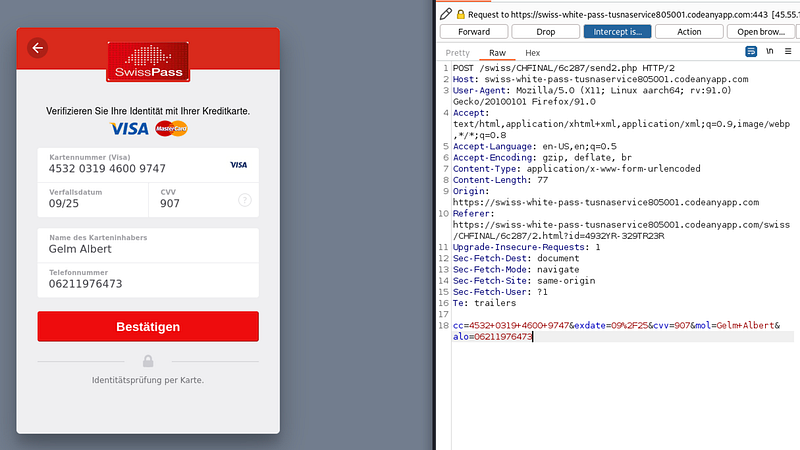

*Figure 6. Synthetic payment-card data and the corresponding intercepted request to `send2.php`.*

**Observation.** The second form submitted payment-card data to `send2.php` and redirected the browser to `3.html`.

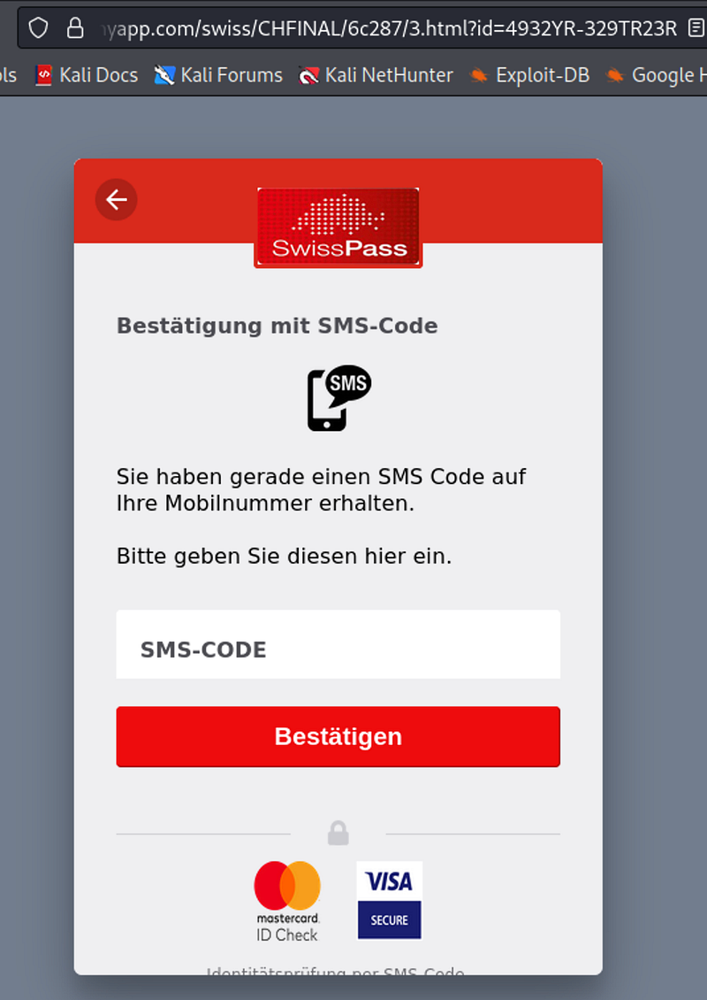

*Figure 7. Third-stage form requesting an SMS verification code.*

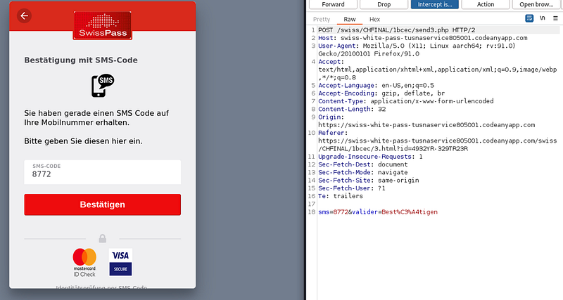

*Figure 8. Intercepted request to `send3.php` containing a synthetic SMS code.*

After the final submission, the browser was redirected to the legitimate SwissPass website.

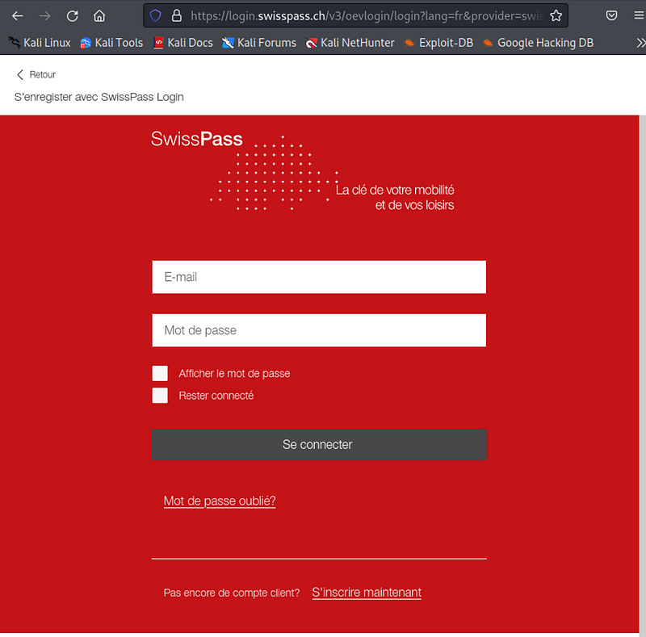

*Figure 9. Final redirect to the legitimate SwissPass website.*

The live session documented the following sequence:

1. `index.php` requested an email address and password.
2. `send1.php` processed the first submission.
3. `2.html` requested payment-card information.
4. `send2.php` processed the second submission.
5. `3.html` requested an SMS verification code.
6. `send3.php` processed the final observed submission.
7. The victim was redirected to the legitimate SwissPass website.

**Assessment.** Redirecting to the legitimate service after collection may reduce suspicion by making the interaction appear to have completed normally.

The recovered archive contained a fuller workflow than the live session exposed: `load.html`, `load2.html`, `4.html`, and `send4.php` were also present, and `send4.php` implemented the final redirect to SwissPass. This indicates either an additional second-code stage or a version or configuration difference between the live deployment and the recovered source. The live observations and recovered-code behavior are therefore described separately below.

## Phase 2 — Recovering and inspecting the phishing kit

Directory enumeration of the exposed `/swiss` path revealed several folders and files.

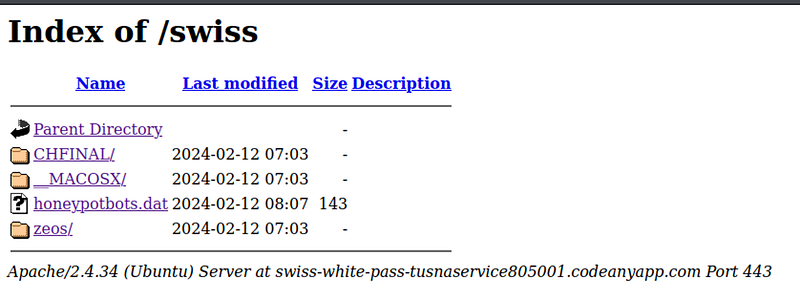

*Figure 10. Public Apache directory listing exposing `CHFINAL`, `_MACOSX`, `honeypotbots.dat`, and `zeos`.*

The `honeypotbots.dat` file contained repeated entries for the same network address.

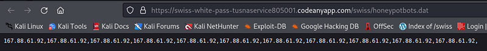

*Figure 11. Visitor records stored in honeypotbots.dat.*

**Observation.** The file recorded multiple requests for which PHP observed the same network source address.

**Assessment.** The same address, `167.88.61.92`, also appeared in `ZA2IR.txt`. Its first recorded timestamp was 24 seconds after the preserved urlscan.io submission began. Given the close timing between the scan and the logged request, it is possible that the address belonged to the urlscan.io scanner, although the available logs cannot confirm this conclusively.

Despite its filename, the artifact is better described as visitor or anti-bot logging. It does not demonstrate that a conventional honeypot was triggered.

Based on a [demonstration of exposed ZIP archives](https://youtu.be/HwozWl77f3A?si=dD5gP3HZ4xMw57gQ), I tested whether the `/swiss` directory had a corresponding `swiss.zip` archive. The archive was publicly accessible and contained the phishing-kit source files.

The archive included a `__MACOSX` directory containing AppleDouble metadata sidecars associated with the packaged files.

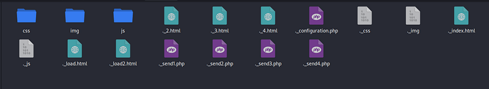

*Figure 12. Extracted archive containing phishing pages, PHP handlers, and AppleDouble `._*` metadata sidecars.*

**Observation.** The `__MACOSX` directory and Apple extended attributes are consistent with the archive having been created or processed on macOS.

**Attribution limitation.** This does not establish that the phishing operator personally used a Mac. The archive could have been created, repackaged, or transferred by another person or system.

An extended attribute included `com.apple.quarantine` data and a reference to Microsoft Remote Desktop.

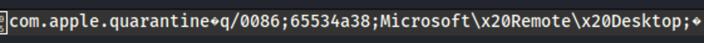

*Figure 13. Apple quarantine metadata associated with Microsoft Remote Desktop.*

**Attribution limitation.** The Microsoft Remote Desktop reference is an artifact of the file's handling history. It does not prove that the operator used Remote Desktop to administer the phishing server.

ExifTool reported filesystem metadata stored in the `._index.html` AppleDouble sidecar.

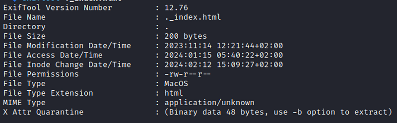

*Figure 14. ExifTool metadata from the `._index.html` AppleDouble sidecar.*

The sidecar displayed a modification timestamp of November 14, 2023 at 12:21:44 +02:00.

**Attribution limitation.** This is filesystem metadata from the extracted sidecar. It may have been preserved from the archive or affected by packaging and extraction, so it is a timeline lead rather than proof of when the operator created or used the kit.

The Zeos directory contained a group of anti-analysis scripts.

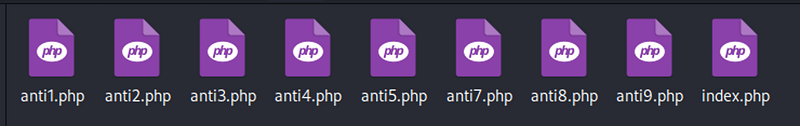

*Figure 15. Recovered anti1.php through anti9.php files; anti6.php was absent.*

The recovered `index.php` file used `file_put_contents()` to append the value of `REMOTE_ADDR` to `honeypotbots.dat`.

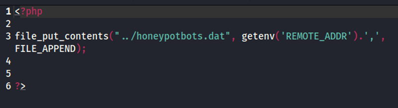

*Figure 16. Visitor-logging code from the recovered Zeos index.php file.*

This code explains how the entries were created: a request to `Zeos/index.php` attempted to append the network address observed by PHP. Because no timestamp, requested URL, user agent, or authentication context was stored in this file, an entry cannot identify a specific person, device, or role.

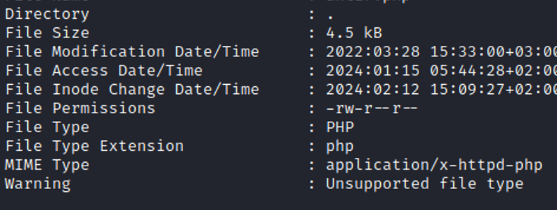

*Figure 17. Metadata for the visitor-logging PHP file.*

### Anti-analysis controls

**Observation.** The anti*.php files combine IP patterns, reverse-DNS lookups, user-agent keywords, and hosting-provider checks. Matching visitors are redirected to randomized domains or shown a false 404 response.

**Assessment.** The scripts were intended to reduce exposure to crawlers, security scanners, cloud-hosted analysis systems, and automated reputation services. Their implementation is inconsistent: several regular expressions are overly broad, some branches do not terminate after a redirect, and anti8.php can miss matches because it does not compare stripos() against false explicitly.

The presence of these files establishes the design intent of the archived code. The retained evidence does not show whether the SwissPass workflow included or executed them during the live session.

| File | Summary | Notable implementation detail | Evidence |
| --- | --- | --- | --- |
| anti1.php | Filters source IPs, reverse-DNS hostnames, and a small user-agent list. | Several redirect branches do not terminate execution, and its case-sensitive and loosely written patterns can produce inconsistent results. | [Source](https://pastebin.com/2phgy08i) · [VirusTotal](https://www.virustotal.com/gui/file/ef49a8686cc4467154bce98cce6293767e4540e1b2722136fd2f019592f7e446) |
| anti2.php | Implements a smaller IP-only denylist. | The unescaped regular-expression patterns are broader than conventional IP matching, and the pattern-matching branch does not stop execution after redirecting. | [Source](https://pastebin.com/BH74J8UW) · [VirusTotal](https://www.virustotal.com/gui/file/0106a39c2ed9a1cd7e6578208f51ad27329b39b6e3e6a62876c8a204b8ed5aed) |
| anti3.php | Combines IP and user-agent filtering with blocked-request logging. | captured.txt receives the matching pattern variable rather than the visitor's actual IP address; matching branches can also continue executing after a redirect. | [Source](https://pastebin.com/gXWjHaLJ) · [VirusTotal](https://www.virustotal.com/gui/file/58eed87646b162628a52fd449e16aba3c87163b73177e2bca675410fdc7dd089) |
| anti4.php | Checks reverse-DNS hostnames and source IPs against extensive lists. | Many crawler and browser terms are mistakenly compared with the hostname rather than the user agent, making much of the list ineffective. | [Source](https://pastebin.com/KLePJB6Z) · [VirusTotal](https://www.virustotal.com/gui/file/e6fd7b76c6eff67bed5be76de27228f48285fb5f460c985e3fe4fd0b9976ce7d) |
| anti5.php | Filters user agents, IPs, hostnames, and network organizations returned by ipinfo.io. | It queries ipinfo.io over HTTP, can fail open if the lookup fails, and contains case-sensitive and malformed matching entries. | [Source](https://pastebin.com/98XVGJn5) · [VirusTotal](https://www.virustotal.com/gui/file/f4d4df18152c80b74668e5612a7300418f74dbc8f5950539564dc3e127fff8ab) |
| anti6.php | No anti6.php file was present in the recovered archive. | The numbering gap may reflect an omitted file or a bundle assembled from multiple sources; the archive alone cannot distinguish between them. | — |
| anti7.php | Filters IPs and normalized user-agent strings while suppressing PHP error output and logging. | It terminates matched requests reliably, although one assignment placed after exit() is unreachable. | [Source](https://pastebin.com/QPzX18D1) · [VirusTotal](https://www.virustotal.com/gui/file/f24bc0dadb45b054398fc0c38fa138f56dad4f8f40e319b1b8b27f059804db27) |
| anti8.php | Applies large IP and user-agent blocklists. | It treats a stripos() match at character position zero as false, allowing some user agents that begin with a blocked term to bypass that check; broad terms may also block legitimate browsers. | [Source](https://pastebin.com/dJYQ7wf1) · [VirusTotal](https://www.virustotal.com/gui/file/28e6e2c9bef4406b6e1b02e98a96881e837568d234a2e4589c15df8912fe24c3) |
| anti9.php | Uses a large IP list and reverse-DNS keywords to return a false 404 response. | Its IP check uses literal in_array() comparisons, so most entries written as wildcard-like regular expressions cannot match a normal IP address. | [Source](https://pastebin.com/0fhWe4e1) · [VirusTotal](https://www.virustotal.com/gui/file/0c97ab9e8d0c75d08830e8016996d2fb139afb762f6362660464d2d50d5913cd) |

The VirusTotal hashes were calculated from the original recovered files. The copies uploaded to Pastebin were cleaned and reformatted for presentation, so their exact bytes may differ. This can produce a hash discrepancy even when the PHP logic remains unchanged.

## Phase 3 — Application logic and data exfiltration

The `CHFINAL/index.php` file performed several functions:

1. It read `REMOTE_ADDR` and attempted to obtain a country label through an HTTP GeoPlugin lookup.
2. It appended the observed address, timestamp, and country label to `ZA2IR.txt`.
3. It generated a short, randomized directory name for that request.
4. It recursively copied the phishing pages into that directory.
5. It redirected the visitor to the generated path.

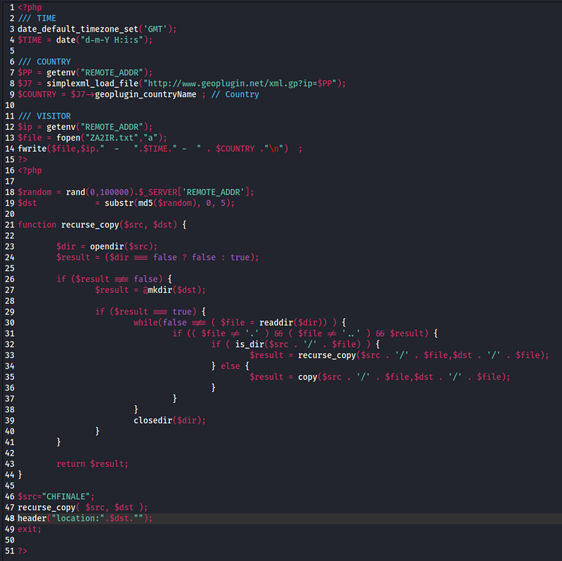

*Figure 18. CHFINAL index.php logging visitors and creating a randomized deployment path.*

**Assessment.** Each request generated a five-character path from a non-cryptographic random value combined with `REMOTE_ADDR`. This reduced casual URL predictability, but it did not create a stable or guaranteed-unique identifier for each visitor. The country value was an IP-geolocation estimate rather than evidence of a person's physical location.

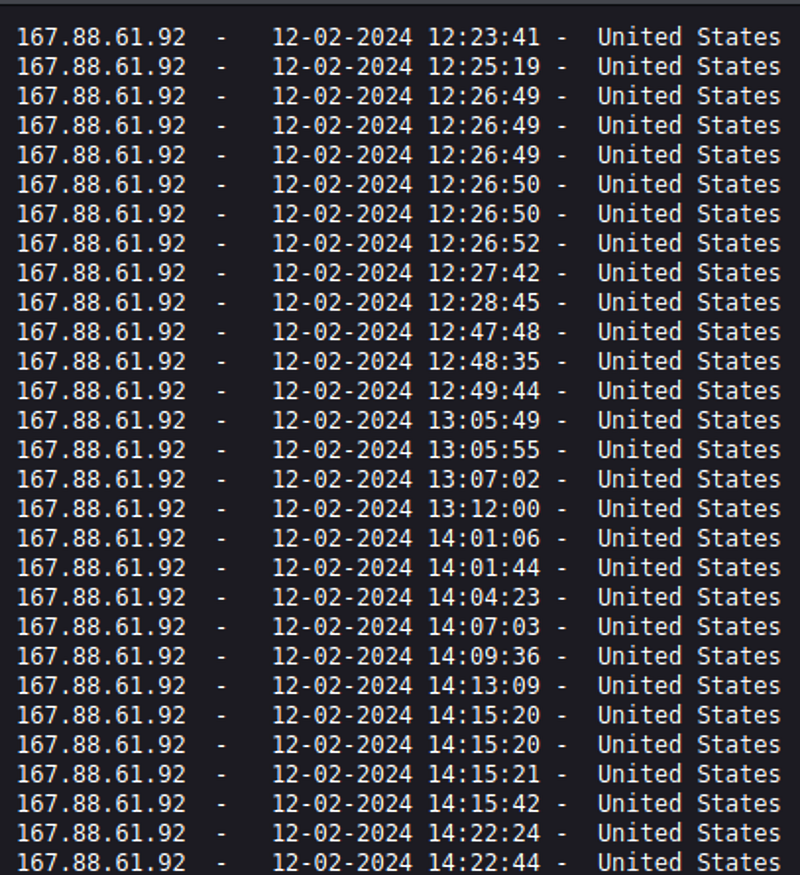

*Figure 19. Visitor information recorded in ZA2IR.txt.*

The generated directory contained the phishing pages, configuration file, and submission handlers.

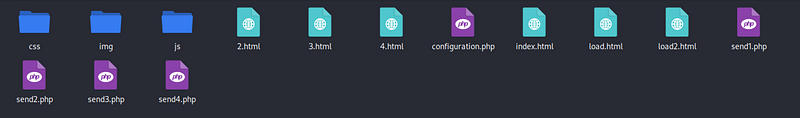

*Figure 20. Recovered application files used by the SwissPass-themed workflow.*

The configuration file defined a Telegram bot token and chat identifier. The recovered handlers also referenced an email destination variable, `$MyEmail`, that was not defined in the recovered copy.

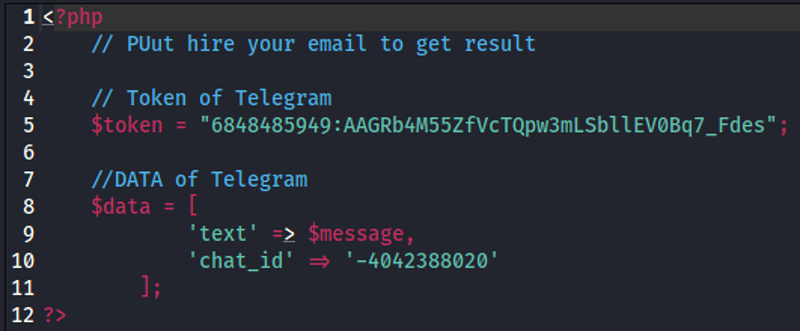

*Figure 21. Recovered configuration.php showing the Telegram delivery channel and an unpopulated email setting.*

**Observation.** The `send1.php` handler assembled the first-stage account data, called `mail()`, and submitted the same message through the Telegram Bot API.

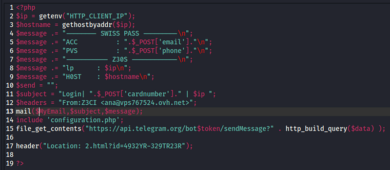

*Figure 22. First-stage handler collecting account credentials and host information.*

The remaining handlers followed the same collection pattern for payment-card and SMS-verification data. In the recovered source, `send2.php` redirected to `load.html`, `send3.php` handled a first `sms` value and redirected to `load2.html`, and `send4.php` handled a second `sms2` value before redirecting to the legitimate SwissPass site. This was the additional stage not observed in the live browser session.

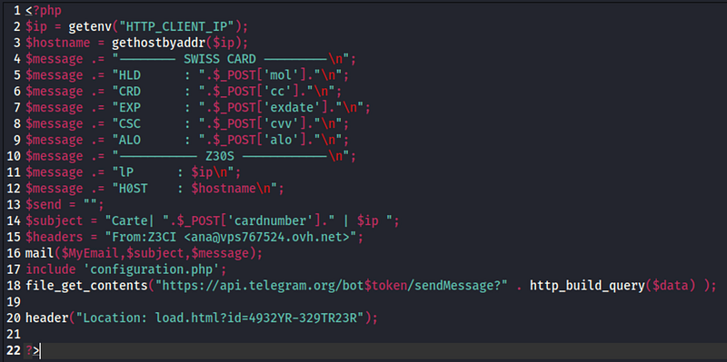

*Figure 23. Payment-card handler collecting cardholder and host information.*

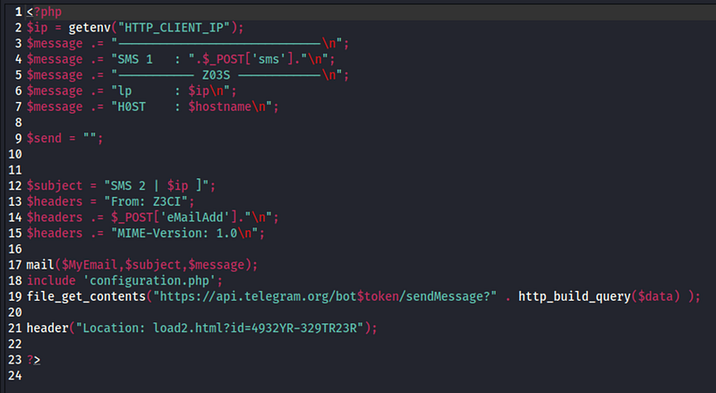

*Figure 24. Handler assembling an SMS-verification message and attempting email and Telegram delivery.*

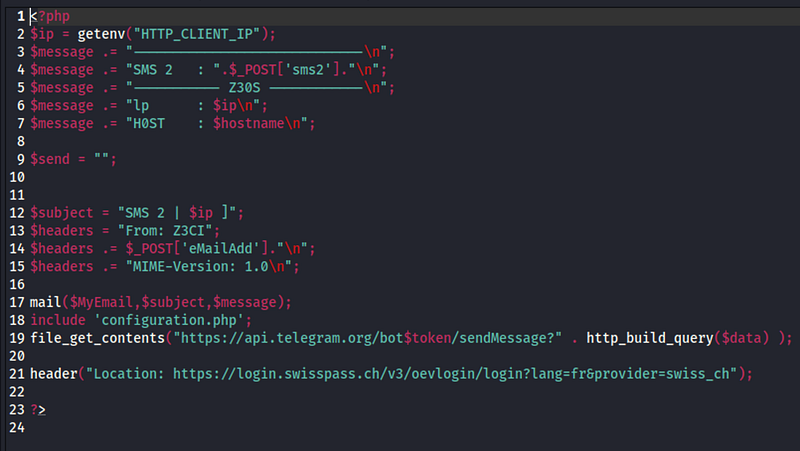

*Figure 25. `send4.php` attempting to transmit the second verification code before redirecting to the legitimate service.*

**Assessment.** Telegram was the only delivery path demonstrably configured in the recovered copy. The handlers called `mail()` before loading `configuration.php`, and `$MyEmail` was undefined, so email delivery would not function as shown. The Telegram calls did not check the API response, so the source demonstrates intended transmission logic rather than successful delivery through either channel.

The handlers derived their reported client address from `HTTP_CLIENT_IP`. That value is often absent and may be supplied by the client unless a trusted proxy controls it, so the resulting IP and reverse-DNS fields are not reliable attribution evidence.

The value `ana@vps767524[.]ovh[.]net` appeared in a hard-coded `From:` header. It is an infrastructure indicator, but it was not the configured recipient and is insufficient to identify or attribute the operator.

## Phase 4 — WordPress discovery and scope boundary

The root domain hosted a default WordPress site.

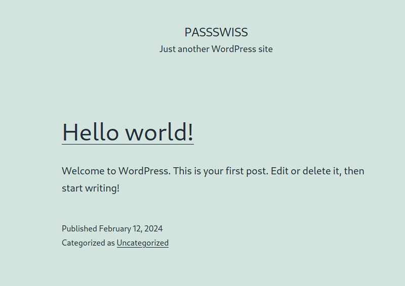

*Figure 26. Public WordPress site observed on the related root domain.*

The standard WordPress administration login page was accessible at /wp-admin.

*Figure 27. Publicly reachable WordPress authentication page.*

One invalid login submission produced a password-specific response associated with the value `passswiss`. This was consistent with WordPress recognizing it as a username, although it remained an inference from the application's response.

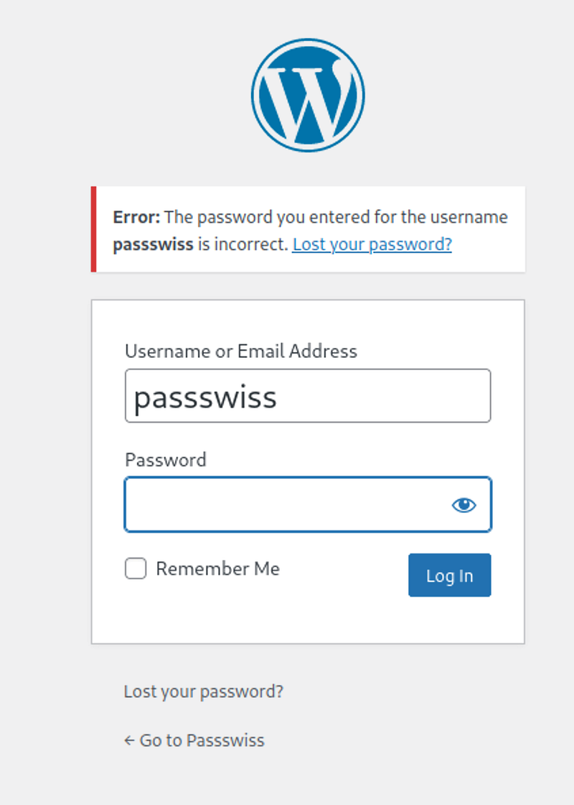

*Figure 28. Password-specific WordPress response used to infer a likely username.*

This marked the investigation boundary. [Article 360 of Romania's Criminal Code](https://legislatie.just.ro/Public/DetaliiDocument/269777) addresses access to a computer system without right. [Constitutional Court Decision 183/2018](https://legislatie.just.ro/Public/DetaliiDocumentAfis/201454) explains that acting without right includes acting without authorization, exceeding the limits of authorization, or operating without permission from the person or organization entitled to grant it. Because I did not have authorization to test the WordPress instance, I made no additional credential attempts and did not access the administrative area.

## Scope and limitations

- The Romanian Post lure and SwissPass deployment were separate findings on a shared hosting platform; the available evidence does not connect their operators.
- The live browser session and recovered source showed slightly different SwissPass workflows. Both are reported, but the archive should not be treated as an exact record of every live request.
- The form submissions used synthetic test data. No victim data was identified or validated during this investigation.
- The recovered code shows intended collection and transmission behavior. It does not prove that email or Telegram delivery succeeded.
- Public pages, directory listings, an exposed archive, and third-party scan records formed the evidence base. No administrative access to the hosting environment was obtained.
- Historical network indicators, metadata, and source-code artifacts do not identify the operator.

## Conclusion

The investigation preserved a Romanian Post smishing redirect and then examined a separate SwissPass-themed phishing deployment discovered on the same hosting platform. The live SwissPass session requested three categories of information: account credentials, payment-card details, and an SMS verification code. The recovered source was designed to support an additional verification-code stage before redirecting a visitor to the legitimate service.

The exposed source archive also revealed:

- visitor logging and randomized per-request deployment paths;
- anti-analysis scripts based on IP, user-agent, reverse-DNS, and ISP checks, although their execution in the live workflow was not established;
- configured Telegram exfiltration logic and a nonfunctional or incomplete email-delivery path;
- artifacts consistent with the archive having been processed on macOS;
- historical metadata that provided timeline leads but did not support reliable attribution.

The SwissPass artifacts support the assessment that this was a reusable phishing kit with layered but inconsistently implemented evasion code. The Romanian and SwissPass deployments shared a hosting platform, but the available evidence does not establish a common operator. The artifacts document intended collection and transmission behavior without identifying the operator, proving successful exfiltration, or establishing the existence of victims.
